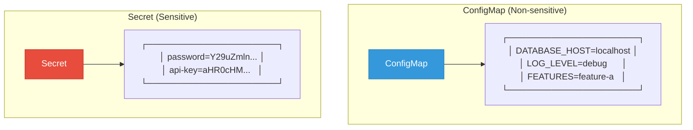
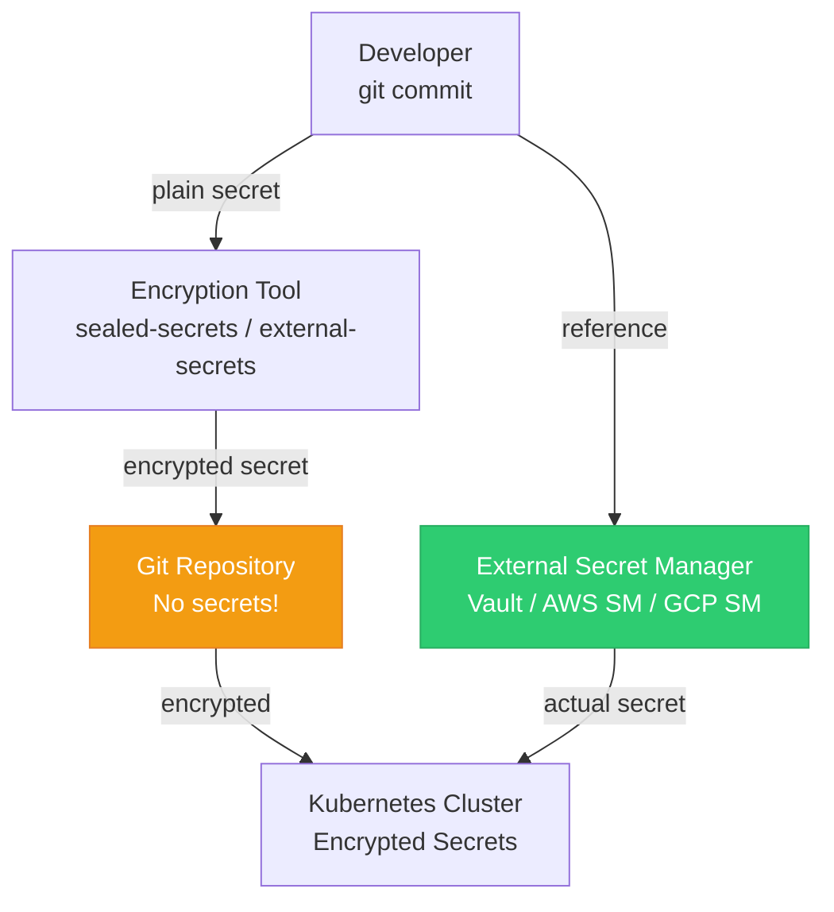

## ConfigMap and Secret

These two resources help you separate configuration from container images, following the 12-factor app methodology.

---

## ConfigMap vs Secret

<div class="diagram-container">

</div>

| Feature | ConfigMap | Secret |
|---------|-----------|--------|
| **Data** | Plain text | Base64 encoded |
| **Usage** | Non-sensitive config | Passwords, keys, tokens |
| **Etcd storage** | Plain | Can be encrypted at rest |
| **Visibility** | Anyone with cluster access | Restricted by RBAC |

---

## ConfigMap

### Creating ConfigMap

```yaml
apiVersion: v1
kind: ConfigMap
metadata:
  name: app-config
data:
  # Key-value pairs
  DATABASE_HOST: "postgres.default.svc.cluster.local"
  DATABASE_PORT: "5432"
  LOG_LEVEL: "info"
  FEATURES: "feature-a,feature-b,feature-c"

  # Multi-line config file
  nginx.conf: |
    server {
      listen 80;
      location / {
        proxy_pass http://backend:8080;
      }
    }
```

### Using ConfigMap

#### 1. As Environment Variables

```yaml
apiVersion: v1
kind: Pod
metadata:
  name: app-pod
spec:
  containers:
  - name: app
    image: myapp:latest
    env:
    # Single key
    - name: DATABASE_HOST
      valueFrom:
        configMapKeyRef:
          name: app-config
          key: DATABASE_HOST

    # All keys as env vars
    envFrom:
    - configMapRef:
        name: app-config
```

#### 2. As Volume Mount

```yaml
apiVersion: v1
kind: Pod
metadata:
  name: app-pod
spec:
  containers:
  - name: app
    image: myapp:latest
    volumeMounts:
    - name: config
      mountPath: /etc/config
      readOnly: true
  volumes:
  - name: config
    configMap:
      name: app-config
```

Result in container:
```
/etc/config/
├── DATABASE_HOST     → "postgres.default.svc.cluster.local"
├── DATABASE_PORT     → "5432"
├── LOG_LEVEL        → "info"
├── FEATURES         → "feature-a,feature-b,feature-c"
└── nginx.conf       → (multi-line content)
```

---

## Secret

### Creating Secret

```yaml
apiVersion: v1
kind: Secret
metadata:
  name: app-secret
type: Opaque
data:
  # Values must be base64 encoded
  password: cGFzc3dvcmQxMjM=           # "password123"
  api-key: YXBpLWtleS1zZWNyZXQ=       # "api-key-secret"
```

**Encode values:**
```bash
echo -n "password123" | base64
# Output: cGFzc3dvcmQxMjM=
```

### Using Secret

#### As Environment Variables

```yaml
apiVersion: v1
kind: Pod
metadata:
  name: app-pod
spec:
  containers:
  - name: app
    image: myapp:latest
    env:
    - name: DB_PASSWORD
      valueFrom:
        secretKeyRef:
          name: app-secret
          key: password
    envFrom:
    - secretRef:
        name: app-secret
```

#### As Volume Mount

```yaml
apiVersion: v1
kind: Pod
metadata:
  name: app-pod
spec:
  containers:
  - name: app
    image: myapp:latest
    volumeMounts:
    - name: secret
      mountPath: /etc/secrets
      readOnly: true
  volumes:
  - name: secret
    secret:
      secretName: app-secret
```

---

## Secret Types

| Type | Description |
|------|-------------|
| **Opaque** | Arbitrary user data (default) |
| **kubernetes.io/service-account-token** | Service account token |
| **kubernetes.io/dockercfg** | Docker registry auth |
| **kubernetes.io/dockerconfigjson** | Docker config.json |
| **kubernetes.io/basic-auth** | Basic authentication |
| **kubernetes.io/ssh-auth** | SSH authentication |
| **kubernetes.io/tls** | TLS certificate data |
| **bootstrap.kubernetes.io/token** | Bootstrap token |

### TLS Secret Example

```yaml
apiVersion: v1
kind: Secret
metadata:
  name: tls-cert
type: kubernetes.io/tls
data:
  tls.crt: <base64-encoded-cert>
  tls.key: <base64-encoded-key>
```

---

## Immutable ConfigMap/Secret

```yaml
apiVersion: v1
kind: ConfigMap
metadata:
  name: app-config
immutable: true    # Cannot be changed after creation
data:
  LOG_LEVEL: "info"
```

**Benefits:**
- Improves performance (no watches)
- Prevents accidental changes
- Required for Pod anti-affinity with large configs

---

## Commands

```bash
# Create ConfigMap from literal
kubectl create configmap app-config --from-literal=LOG_LEVEL=debug

# Create ConfigMap from file
kubectl create configmap nginx-config --from-file=nginx.conf

# Create ConfigMap from directory
kubectl create configmap app-config --from-file=./config/

# Create Secret from literal
kubectl create secret generic app-secret --from-literal=password=secret123

# Create Secret from file
kubectl create secret generic tls-cert --from-file=tls.crt --from-file=tls.key

# Create Secret from docker registry
kubectl create secret docker-registry regcred \
  --docker-server=registry.example.com \
  --docker-username=user \
  --docker-password=pass

# Get ConfigMap
kubectl get configmap app-config -o yaml

# Get Secret (decoded)
kubectl get secret app-secret -o jsonpath='{.data.password}' | base64 -d
```

---

## Best Practices

1. **Never store secrets in ConfigMaps** - use Secret
2. **Don't commit secrets to Git** - use sealed-secrets or external secret managers
3. **Use immutable when possible** - better performance
4. **Version your configs** - use git for ConfigMaps
5. **Use volume mounts for files** - env vars for simple values
6. **Encode secrets properly** - use `echo -n | base64`
7. **Rotate secrets regularly** - automate secret rotation
8. **Use external secret managers** - Vault, AWS Secrets Manager, etc.

---

## Secret Management Tools

<div class="diagram-container">

</div>

| Tool | Description |
|------|-------------|
| **sealed-secrets** | Encrypt secrets that can be committed to Git |
| **external-secrets** | Sync secrets from external providers |
| **Vault** | HashiCorp Vault integration |
| **AWS Secrets Manager** | AWS secret storage |
| **GCP Secret Manager** | Google Cloud secret storage |

---

## Summary

| Resource | Use For | Encoding |
|----------|---------|----------|
| **ConfigMap** | Non-sensitive config | Plain text |
| **Secret** | Sensitive data | Base64 |

**Mount types:**
- Environment variables (`env`, `envFrom`)
- Volume mounts (files)
- Both are updated automatically when changed

---

## Next: [Ingress](#) - HTTP/HTTPS routing
