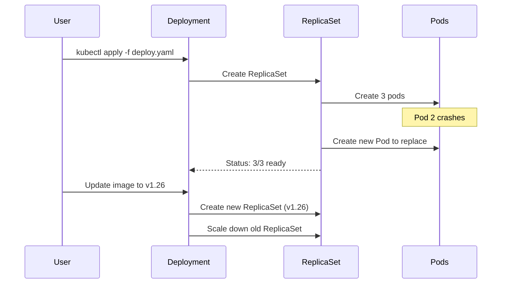

## What is a Deployment?

A **Deployment** manages a set of identical Pods. It ensures:

- A specified number of pods are running
- Pods are healthy and restarted if they fail
- Rolling updates with zero downtime
- Rollback to previous versions

---

## Deployment vs Pod

<div class="diagram-container">
```mermaid
graph TB
    subgraph "Managing Pods Directly (Don't do this!)"
        Manual[Manual Pod Management<br/>kubectl run pod1<br/>kubectl run pod2<br/>kubectl run pod3]
        Manual -.->.hard. Hard[❌ Hard to scale<br/>❌ No self-healing<br/>❌ No rolling updates]
    end

    subgraph "Using Deployment (Do this!)"
        Deploy[Deployment: 3 replicas]
        Deploy --> Pod1[Pod 1]
        Deploy --> Pod2[Pod 2]
        Deploy --> Pod3[Pod 3]
        Deploy -.->.good. Good[✓ Easy scaling<br/>✓ Auto self-healing<br/>✓ Rolling updates]
    end

    style Deploy fill:#3498db,stroke:#2980b9,color:#fff
    style Manual fill:#e74c3c,stroke:#c0392b,color:#fff
```
</div>

---

## Deployment YAML

```yaml
apiVersion: apps/v1
kind: Deployment
metadata:
  name: nginx-deployment
  labels:
    app: nginx
spec:
  replicas: 3                    # Want 3 pods
  selector:
    matchLabels:
      app: nginx                 # Must match pod labels
  template:                      # Pod template
    metadata:
      labels:
        app: nginx
    spec:
      containers:
      - name: nginx
        image: nginx:1.25
        ports:
        - containerPort: 80
```

---

## How Deployment Works

<div class="diagram-container">

</div>

---

## Rolling Update Strategy

<div class="diagram-container">
```mermaid
graph LR
    subgraph "Rolling Update Process"
        direction TB
        Old[Old Pods: v1.25<br/>● ● ● ● ●]

        Step1[Step 1: Start new pods<br/>● ● ● ● ●<br/>○ ○]
        Step2[Step 2: Terminate old<br/>● ● ● ●<br/>○ ○ ○]
        Step3[Step 3: Continue...<br/>● ● ●<br/>○ ○ ○ ○]
        Step4[Step 4: Complete<br/>○ ○ ○ ○ ○<br/>(New: v1.26)]
    end

    style Old fill:#e74c3c,stroke:#c0392b,color:#fff
    style Step4 fill:#2ecc71,stroke:#27ae60,color:#fff
```
</div>

```yaml
spec:
  replicas: 5
  strategy:
    type: RollingUpdate
    rollingUpdate:
      maxSurge: 2        # Can create 2 extra pods during update
      maxUnavailable: 1  # At most 1 pod can be down
```

---

## Deployment Commands

```bash
# Create deployment
kubectl create deployment nginx --image=nginx:1.25

# Scale up/down
kubectl scale deployment nginx --replicas=5

# Update image (triggers rolling update)
kubectl set image deployment/nginx nginx=nginx:1.26

# Check rollout status
kubectl rollout status deployment/nginx

# View rollout history
kubectl rollout history deployment/nginx

# Rollback to previous version
kubectl rollout undo deployment/nginx

# Rollback to specific version
kubectl rollout undo deployment/nginx --to-revision=2
```

---

## Deployment States

| State | Description |
|-------|-------------|
| **Progressing** | Deployment is creating/replicating pods |
| **Complete** | All pods are updated and healthy |
| **Failed** | Deployment couldn't complete (progress deadline exceeded) |

---

## ReplicaSet: Behind the Scenes

<div class="concept-box">
<strong>Deployment creates ReplicaSet, ReplicaSet creates Pods.</strong><br><br>
You rarely interact with ReplicaSets directly. The Deployment manages them for you.
</div>

```
Deployment (nginx-deployment)
    │
    ├── ReplicaSet (nginx-deployment-7d64c5d9f9)  ← Old version
    │    └── Pods: nginx-deployment-7d64c5d9f9-abc123
    │
    └── ReplicaSet (nginx-deployment-5f8c6d9b7c)  ← New version
         └── Pods: nginx-deployment-5f8c6d9b7c-xyz789
```

---

## Best Practices

1. **Always use Deployments** - not bare Pods
2. **Set resource requests/limits** - for proper scheduling
3. **Use health checks** - liveness and readiness probes
4. **Configure rolling updates** - set maxSurge and maxUnavailable
5. **Tag your images properly** - use specific tags, not `latest`
6. **Test rollbacks** - make sure you can revert quickly

---

## Common Issues

### Issue: Pods not ready

```bash
kubectl describe deployment nginx
kubectl describe pod <pod-name>
kubectl logs <pod-name>
```

### Issue: Rollout stuck

```bash
kubectl rollout undo deployment/nginx
```

---

## Comparison: Deployment vs StatefulSet

| Feature | Deployment | StatefulSet |
|---------|-----------|-------------|
| **Pod names** | Random | Ordered (web-0, web-1) |
| **Storage** | Shared PVC | Unique PVC per pod |
| **Scaling** | Any order | Sequential |
| **Use for** | Stateless apps | Databases, clusters |

---

## Next: [Service](#) - How to expose your Pods
