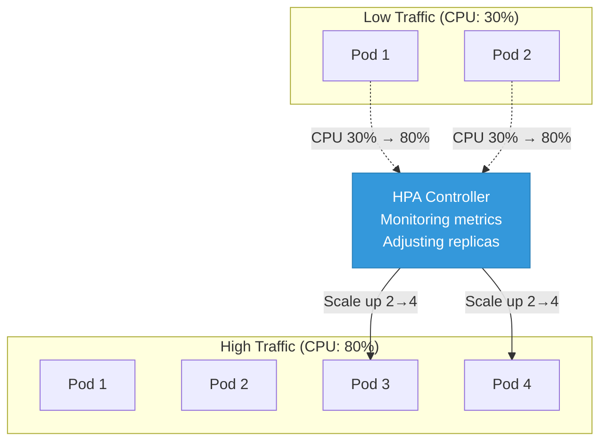
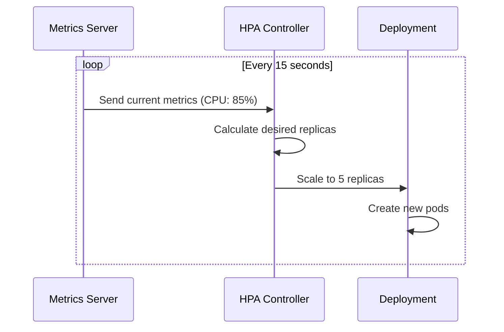
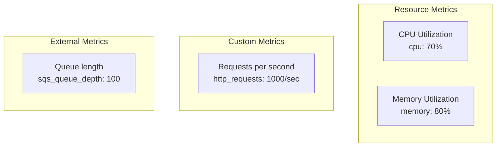

## Horizontal Pod Autoscaler (HPA)

**HPA** automatically scales the number of pods based on observed metrics like CPU and memory usage.

---

## What is HPA?

<div class="diagram-container">

</div>

---

## How HPA Works

<div class="diagram-container">

</div>

**Formula:**
```
desiredReplicas = ceil(currentReplicas × (currentMetric / desiredMetric))

Example:
- Current replicas: 2
- Current CPU: 80%
- Target CPU: 50%
- desiredReplicas = ceil(2 × 80/50) = ceil(3.2) = 4
```

---

## HPA YAML Example

```yaml
apiVersion: autoscaling/v2
kind: HorizontalPodAutoscaler
metadata:
  name: web-hpa
spec:
  scaleTargetRef:
    apiVersion: apps/v1
    kind: Deployment
    name: web-deployment
  minReplicas: 2                  # Minimum pods
  maxReplicas: 10                 # Maximum pods
  metrics:
  - type: Resource
    resource:
      name: cpu
      target:
        type: Utilization
        averageUtilization: 70    # Target CPU 70%

  - type: Resource
    resource:
      name: memory
      target:
        type: Utilization
        averageUtilization: 80    # Target Memory 80%

  behavior:
    scaleDown:
      stabilizationWindowSeconds: 300    # Wait 5min before scaling down
      policies:
      - type: Percent
        value: 50                        # Can scale down by 50%
        periodSeconds: 60
    scaleUp:
      stabilizationWindowSeconds: 0
      policies:
      - type: Percent
        value: 100                       # Can double pod count
        periodSeconds: 15
      - type: Pods
        value: 4                         # Or add max 4 pods
        periodSeconds: 15
      selectPolicy: Max                  # Use the larger policy
```

---

## Metric Types

<div class="diagram-container">

</div>

| Type | Description | Example |
|------|-------------|---------|
| **Resource** | CPU/Memory | cpu: 70%, memory: 80% |
| **Pods** | Value per pod | 1000 requests/sec |
| **Object** | Described object | Ingress requests/sec |
| **External** | Outside cluster | CloudWatch, SQS depth |

---

## Custom Metric Example

```yaml
apiVersion: autoscaling/v2
kind: HorizontalPodAutoscaler
metadata:
  name: app-hpa
spec:
  scaleTargetRef:
    apiVersion: apps/v1
    kind: Deployment
    name: app
  minReplicas: 2
  maxReplicas: 10
  metrics:
  # Scale based on requests per second
  - type: Pods
    pods:
      metric:
        name: http_requests_per_second
      target:
        type: AverageValue
        averageValue: "1000"       # 1000 req/sec per pod

  # Scale based on custom object metric
  - type: Object
    object:
      metric:
        name: requests-per-second
      describedObject:
        apiVersion: networking.k8s.io/v1
        kind: Ingress
        name: main-ingress
      target:
        type: Value
        value: "10k"               # Total 10k req/sec
```

---

## Scaling Behavior

```yaml
behavior:
  scaleDown:
    stabilizationWindowSeconds: 300    # Prevent flapping
    policies:
    - type: Percent
      value: 50                        # Reduce by 50%
      periodSeconds: 60                # Once per minute
    - type: Pods
      value: 2                         # Or remove 2 pods at a time
      periodSeconds: 60
    selectPolicy: Min                  # Use the smaller policy

  scaleUp:
    stabilizationWindowSeconds: 0      # Scale up immediately
    policies:
    - type: Percent
      value: 100                       # Can double
      periodSeconds: 15                # Every 15 seconds
    - type: Pods
      value: 4                         # Or add 4 pods
      periodSeconds: 15
    selectPolicy: Max                  # Use the larger policy
```

---

## Requirements

<div class="concept-box">
<strong>HPA Requirements:</strong><br>
1. Metrics Server installed (for CPU/memory)<br>
2. Pods have resource requests set<br>
3. HorizontalPodAutoscaler API enabled
</div>

### Install Metrics Server

```bash
kubectl apply -f https://github.com/kubernetes-sigs/metrics-server/releases/latest/download/components.yaml

# Verify
kubectl get apiservice v1beta1.metrics.k8s.io
kubectl top nodes
kubectl top pods
```

---

## HPA Commands

```bash
# Create HPA
kubectl autoscale deployment web-deployment \
  --cpu-percent=70 \
  --min=2 \
  --max=10

# List HPAs
kubectl get hpa

# Get HPA details
kubectl describe hpa web-hpa

# Get HPA YAML
kubectl get hpa web-hpa -o yaml

# Delete HPA
kubectl delete hpa web-hpa
```

---

## Example Output

```bash
$ kubectl get hpa
NAME        REFERENCE                      TARGETS         MINPODS   MAXPODS   REPLICAS   AGE
web-hpa     Deployment/web-deployment     80%/70%          2         10        5          30d

$ kubectl describe hpa web-hpa
Name:                       web-hpa
Namespace:                  default
Labels:                     <none>
Annotations:                <none>
CreationTimestamp:          Wed, 01 Jan 2025 00:00:00 +0000
Reference:                  Deployment/web-deployment
Metrics:                    ( current / target )
  resource cpu on pods:     80% / 70%
Min replicas:               2
Max replicas:               10
Deployment pods:            5 current / 5 desired
Conditions:
  Type:                      AbleToScale
  Status:                    True
  Reason:                    ReadyForNewScale
  Message:                   recommended size matches current size
```

---

## Common Issues

### HPA Not Scaling

**Problem:** `unknown / 70%`

**Cause:** No resource requests set

```yaml
# Add resource requests
spec:
  template:
    spec:
      containers:
      - name: app
        image: app:v1
        resources:
          requests:
            cpu: 100m
            memory: 128Mi
```

### Flapping (Frequent Scale Up/Down)

**Solution:** Add stabilization window

```yaml
behavior:
  scaleDown:
    stabilizationWindowSeconds: 300
```

### Can't Scale Below minReplicas

**Problem:** Want 0 pods

**Solution:** HPA minimum is 1. Use KEDA for event-driven scale-to-zero.

---

## HPA vs VPA

| Feature | HPA | VPA |
|---------|-----|-----|
| **Scales** | Number of pods | Pod resources |
| **Direction** | Horizontal | Vertical |
| **What changes** | Replicas | CPU/Memory requests |
| **Downtime** | No | Yes (recreates pods) |

---

## Best Practices

1. **Always set resource requests** - HPA needs them
2. **Set reasonable min/max** - Prevent surprises
3. **Use multiple metrics** - CPU + memory + custom
4. **Configure scaling behavior** - Control rate of change
5. **Monitor HPA events** - Check why scaling happens
6. **Test before production** - Simulate load
7. **Use stabilization window** - Prevent flapping
8. **Consider KEDA** - For event-driven scaling

---

## Summary

```
┌────────────────────────────────────────────────────────────┐
│  HPA monitors metrics → calculates desired replicas        │
│  → scales Deployment up/down automatically                 │
│                                                            │
│  High CPU/traffic → Scale up                               │
│  Low CPU/traffic → Scale down                              │
└────────────────────────────────────────────────────────────┘
```

| Key Settings | Description |
|--------------|-------------|
| **minReplicas** | Minimum pod count |
| **maxReplicas** | Maximum pod count |
| **target** | Metric threshold (e.g., CPU 70%) |
| **stabilizationWindowSeconds** | Wait before scaling down |

---

## Next: [Storage](#) - PV, PVC, StorageClass
