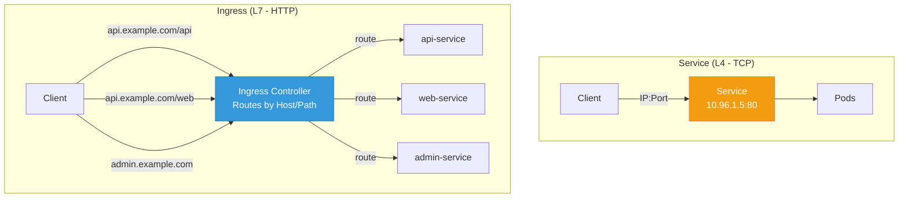
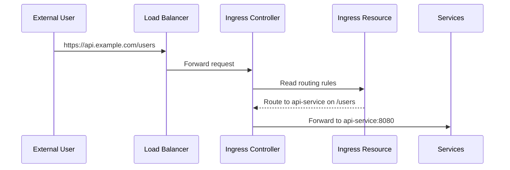
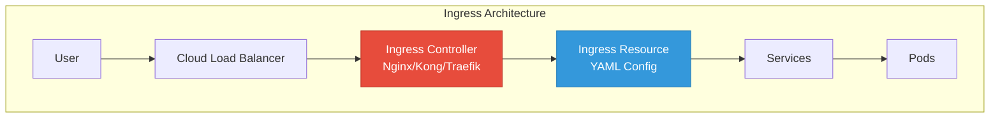
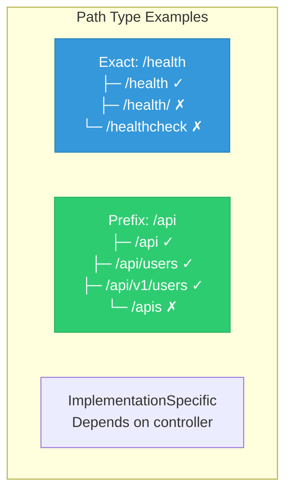

## What is Ingress?

**Ingress** manages external access to services in a cluster, typically HTTP/HTTPS. It provides:

- Host-based routing (api.example.com, web.example.com)
- Path-based routing (/api, /web, /admin)
- TLS termination (HTTPS)
- Load balancing
- Advanced features (auth, rate limiting, rewriting)

---

## Ingress vs Service

<div class="diagram-container">

</div>

| Feature | Service | Ingress |
|---------|---------|---------|
| **Layer** | L4 (TCP/UDP) | L7 (HTTP/HTTPS) |
| **Routing** | IP:Port | Host, Path, Headers |
| **TLS** | Passthrough | Termination |
| **Rules** | None | Complex routing |

---

## How Ingress Works

<div class="diagram-container">

</div>

---

## Ingress Components

<div class="diagram-container">

</div>

**Two parts needed:**

1. **Ingress Controller** - The server that processes rules (Nginx, Kong, Traefik, GKE Ingress)
2. **Ingress Resource** - YAML defining routing rules

---

## Ingress YAML

```yaml
apiVersion: networking.k8s.io/v1
kind: Ingress
metadata:
  name: web-ingress
  annotations:
    nginx.ingress.kubernetes.io/rewrite-target: /
    cert-manager.io/cluster-issuer: letsencrypt-prod
spec:
  ingressClassName: nginx
  tls:
  - hosts:
    - api.example.com
    secretName: api-tls
  rules:
  - host: api.example.com
    http:
      paths:
      - path: /api
        pathType: Prefix
        backend:
          service:
            name: api-service
            port:
              number: 8080
      - path: /
        pathType: Prefix
        backend:
          service:
            name: web-service
            port:
              number: 80
```

---

## Path Types

<div class="diagram-container">

</div>

| Type | Description | Use For |
|------|-------------|---------|
| **Exact** | Must match exactly | Health checks, specific endpoints |
| **Prefix** | Matches path and everything below | General API routes |
| **ImplementationSpecific** | Controller-dependent | Special features |

---

## Ingress Controllers

| Controller | Description |
|------------|-------------|
| **Nginx** | Most popular, feature-rich |
| **Kong** | API Gateway with plugins |
| **Traefik** | Auto-discovery, modern |
| **GKE Ingress** | Google Cloud managed |
| **AWS ALB** | AWS Application Load Balancer |
| **Contour** | Envoy-based |

---

## Common Annotations

```yaml
annotations:
  # Redirect HTTP to HTTPS
  nginx.ingress.kubernetes.io/ssl-redirect: "true"

  # Rewrite path
  nginx.ingress.kubernetes.io/rewrite-target: /$2

  # CORS headers
  nginx.ingress.kubernetes.io/enable-cors: "true"
  nginx.ingress.kubernetes.io/cors-allow-origin: "*"

  # Rate limiting
  nginx.ingress.kubernetes.io/limit-rps: "100"

  # Basic auth
  nginx.ingress.kubernetes.io/auth-type: basic
  nginx.ingress.kubernetes.io/auth-secret: basic-auth
```

---

## Multiple Hosts Example

```yaml
apiVersion: networking.k8s.io/v1
kind: Ingress
metadata:
  name: multi-host-ingress
spec:
  ingressClassName: nginx
  rules:
  - host: api.example.com
    http:
      paths:
      - path: /
        pathType: Prefix
        backend:
          service:
            name: api-service
            port:
              number: 8080

  - host: web.example.com
    http:
      paths:
      - path: /
        pathType: Prefix
        backend:
          service:
            name: web-service
            port:
              number: 80
```

---

## Default Backend

```yaml
apiVersion: networking.k8s.io/v1
kind: Ingress
metadata:
  name: ingress-with-default
spec:
  ingressClassName: nginx
  defaultBackend:
    service:
      name: default-service
      port:
        number: 80
  rules:
  - host: api.example.com
    http:
      paths:
      - path: /api
        pathType: Prefix
        backend:
          service:
            name: api-service
            port:
              number: 8080
```

Requests to unknown paths go to `default-service`.

---

## Ingress Class

```yaml
apiVersion: networking.k8s.io/v1
kind: IngressClass
metadata:
  name: nginx-internal
spec:
  controller: k8s.io/ingress-nginx
  parameters:
    apiGroup: k8s.example.com
    kind: ConfigMap
    name: nginx-internal-config
```

Use when running multiple ingress controllers.

---

## Commands

```bash
# List ingresses
kubectl get ingress

# Get ingress details
kubectl describe ingress web-ingress

# Get ingress YAML
kubectl get ingress web-ingress -o yaml

# Delete ingress
kubectl delete ingress web-ingress
```

---

## Best Practices

1. **Use TLS everywhere** - enable HTTPS
2. **Separate controllers** - internal vs external
3. **Use path types correctly** - Exact vs Prefix
4. **Set up cert-manager** - automatic TLS certificates
5. **Monitor ingress** - logs, metrics
6. **Use annotations wisely** - controller-specific

---

## Summary

<div class="concept-box">
<strong>Ingress = HTTP/HTTPS routing into cluster</strong><br><br>
- Needs Ingress Controller (Nginx, Kong, etc.)<br>
- Defined as Ingress resource (YAML)<br>
- Routes by Host, Path, Headers<br>
- Terminates TLS at edge
</div>

---

## Next: [Network Policy](#) - Controlling traffic flow
