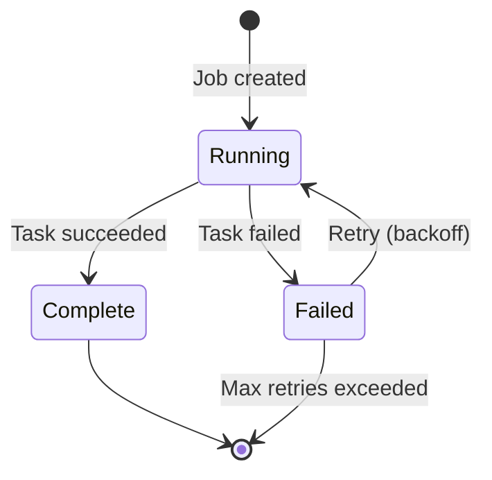
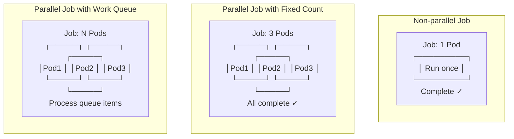
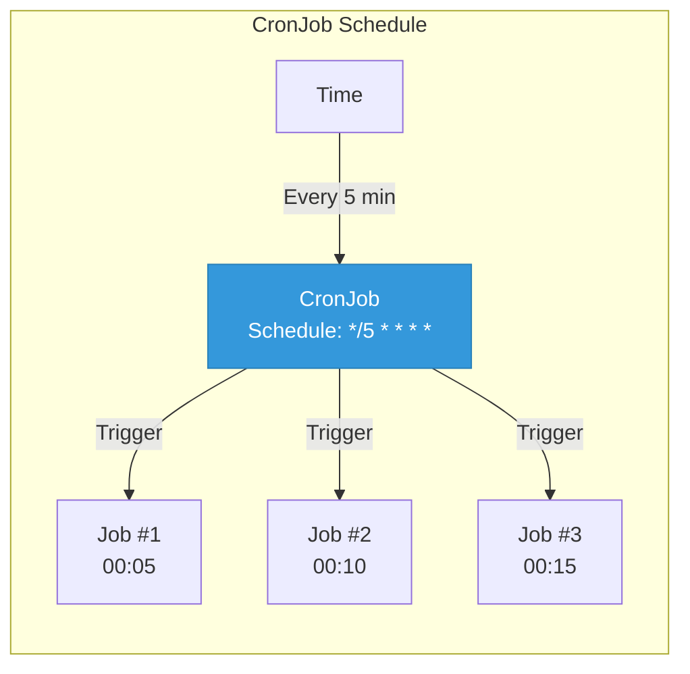
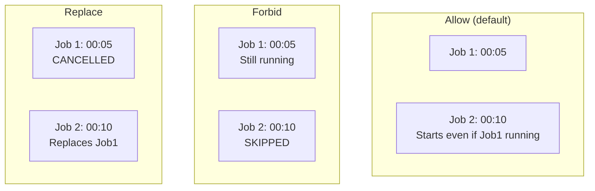

## Job and CronJob

For batch processing and scheduled tasks, K8s provides Jobs and CronJobs instead of Deployments.

---

## Job

### What is a Job?

A **Job** creates one or more pods and ensures they **complete successfully**. Unlike Deployments, Jobs are for tasks that finish.

<div class="diagram-container">

</div>

---

### Job Types

<div class="diagram-container">

</div>

---

### Job YAML Examples

#### Single Pod Job

```yaml
apiVersion: batch/v1
kind: Job
metadata:
  name: backup-job
spec:
  template:
    spec:
      containers:
      - name: backup
        image: backup-tool:v1
        command: ["./backup.sh"]
        restartPolicy: Never      # Jobs use Never or OnFailure
  backoffLimit: 4                # Retry 4 times on failure
```

#### Parallel Job

```yaml
apiVersion: batch/v1
kind: Job
metadata:
  name: parallel-job
spec:
  completions: 5                # Need 5 successful completions
  parallelism: 2                # Run 2 pods in parallel
  template:
    spec:
      containers:
      - name: worker
        image: worker:v1
        command: ["./process.sh"]
      restartPolicy: OnFailure
```

```
Timeline:
├── Pod 1 starts
├── Pod 2 starts
├── Pod 1 completes (1/5 done)
├── Pod 3 starts
├── Pod 2 completes (2/5 done)
├── Pod 4 starts
└── ...until 5 completions
```

---

### Job Completion

```yaml
spec:
  activeDeadlineSeconds: 600    # Kill job after 10 minutes
  backoffLimit: 6               # Max retries (default: 6)
  ttlSecondsAfterFinished: 86400 # Delete after 1 day
```

---

## CronJob

### What is CronJob?

A **CronJob** runs Jobs on a schedule (like cron).

<div class="diagram-container">

</div>

---

### CronJob YAML

```yaml
apiVersion: batch/v1
kind: CronJob
metadata:
  name: backup-cronjob
spec:
  schedule: "0 2 * * *"           # 2 AM every day
  successfulJobsHistoryLimit: 3    # Keep last 3 successful
  failedJobsHistoryLimit: 1        # Keep last 1 failed
  concurrencyPolicy: Forbid        # Don't overlap
  startingDeadlineSeconds: 300     # Skip if missed by 5 min
  jobTemplate:
    spec:
      template:
        spec:
          containers:
          - name: backup
            image: backup-tool:v1
            command:
            - /bin/bash
            - -c
            - |
              echo "Starting backup at $(date)"
              ./backup.sh
              echo "Backup completed at $(date)"
          restartPolicy: OnFailure
```

---

### Cron Schedule Format

```
┌─────────────┬─────────────┬─────────────┬─────────────┬─────────────┐
│   Minute    │    Hour     │     Day     │    Month    │   Day of    │
│  (0-59)     │   (0-23)    │   (1-31)    │   (1-12)    │   Week      │
│             │             │             │             │  (0-6)      │
├─────────────┼─────────────┼─────────────┼─────────────┼─────────────┤
│      *      │      *      │      *      │      *      │      *     │
│  Any minute │   Any hour  │  Any day    │  Any month  │ Any weekday│
└─────────────┴─────────────┴─────────────┴─────────────┴─────────────┘
```

| Schedule | Description |
|----------|-------------|
| `0 * * * *` | Every hour at minute 0 |
| `*/15 * * * *` | Every 15 minutes |
| `0 2 * * *` | 2 AM every day |
| `0 0 * * 0` | Midnight every Sunday |
| `0 0 1 * *` | Midnight on 1st of month |
| `0 */6 * * *` | Every 6 hours |
| `0 9-17 * * 1-5` | Every hour 9AM-5PM, Mon-Fri |

---

### Concurrency Policy

```yaml
concurrencyPolicy: Allow       # Allow overlapping jobs (default)
concurrencyPolicy: Forbid      # Skip if previous still running
concurrencyPolicy: Replace     # Replace running job with new one
```

<div class="diagram-container">

</div>

---

## Job vs CronJob

| Feature | Job | CronJob |
|---------|-----|---------|
| **Trigger** | Manual | Schedule |
| **Use case** | One-time tasks | Recurring tasks |
| **Completion** | Runs once | Runs forever |
| **History** | Kept after completion | Configurable retention |

---

## Use Cases

### Job Use Cases
- Database backups
- Data migration
- Batch processing
- ETL jobs
- One-off calculations

### CronJob Use Cases
- Daily backups
- Log rotation
- Report generation
- Certificate renewal
- Periodic cleanup

---

## Commands

```bash
# List jobs
kubectl get jobs

# List cronjobs
kubectl get cronjobs

# Create a job manually
kubectl create job my-job --image=busybox -- echo "Hello"

# Create a job from cronjob immediately
kubectl create job --from=cronjob/backup-cronjob manual-backup-001

# Get job logs
kubectl logs job/backup-job-abc123

# Delete a job
kubectl delete job backup-job-abc123

# Suspend a cronjob
kubectl patch cronjob backup-cronjob -p '{"spec":{"suspend":true}}'
```

---

## Best Practices

1. **Set resource limits** - jobs can consume lots of resources
2. **Use activeDeadlineSeconds** - prevent hanging jobs
3. **Set ttlSecondsAfterFinished** - auto-cleanup old jobs
4. **Set history limits** - don't clutter etcd
5. **Use concurrencyPolicy** - control overlapping jobs
6. **Monitor job completion** - set up alerts
7. **Handle failures** - set appropriate backoffLimit

---

## Troubleshooting

### Job stuck in Pending
```bash
kubectl describe job <job-name>
# Check for resource limits, scheduling issues
```

### CronJob not creating jobs
```bash
kubectl get cronjob <name> -o yaml
# Check: schedule, suspended status, startingDeadlineSeconds
```

### Job failed but pods are gone
```bash
kubectl get pods --show-all
# Check job logs if pod still exists
```

---

## Summary

```
┌─────────────────────────────────────────────┐
│  Job           →  Run to completion         │
│  CronJob       →  Run on schedule          │
│  Deployment    →  Run forever              │
└─────────────────────────────────────────────┘
```

| Workload Type | Use When... |
|---------------|-------------|
| **Deployment** | App needs to run 24/7 |
| **Job** | One-time batch task |
| **CronJob** | Recurring scheduled task |
| **StatefulSet** | Database or cluster |

---

## Next: [HPA](#) - Auto-scaling
