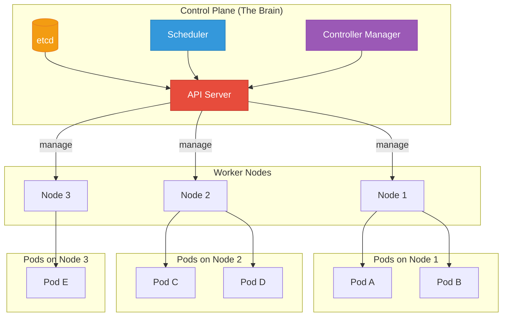

## What is Kubernetes?

Kubernetes (K8s) is an open-source container orchestration platform that automates the deployment, scaling, and management of containerized applications.

### Why K8s?

<strong>The Problem:</strong> You have 100 containers running across multiple servers. One dies. How do you know? How do you replace it? How do you scale when traffic spikes?  
<strong>The Solution:</strong> Kubernetes handles all of this automatically.

---

## K8s Architecture

---

## Control Plane Components

| Component | Responsibility |
|-----------|----------------|
| **API Server** | Frontend to K8s, validates config |
| **etcd** | Key-value store, cluster state |
| **Scheduler** | Decides which node runs pods |
| **Controller Manager** | Maintains desired state |
| **Cloud Controller** | Integrates with cloud providers |

---

## Worker Node Components

| Component | Responsibility |
|-----------|----------------|
| **kubelet** | Agent on each node, talks to API server |
| **kube-proxy** | Network rules, service discovery |
| **Container Runtime** | Runs containers (Docker, containerd) |

---

## K8s Does For You

- ✅ **Self-healing**: Restarts failed containers
- ✅ **Auto-scaling**: Adds/removes pods based on load
- ✅ **Load balancing**: Distributes traffic across pods
- ✅ **Rolling updates**: Zero-downtime deployments
- ✅ **Rollback**: Revert to previous version if something breaks
- ✅ **Secret management**: Securely stores passwords/keys
- ✅ **Storage orchestration**: Mounts storage volumes

---

## Next Steps

Now that you understand the architecture, let's dive into specific components:

1. [Pod](#) - The smallest unit
2. [Deployment](#) - Managing replicas
3. [Service](#) - Networking basics
