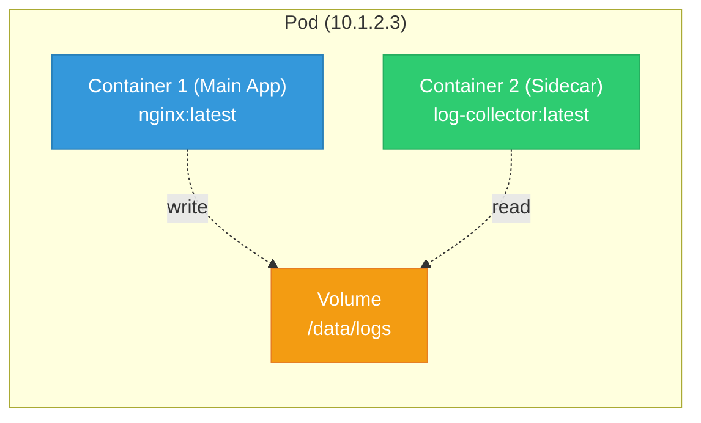
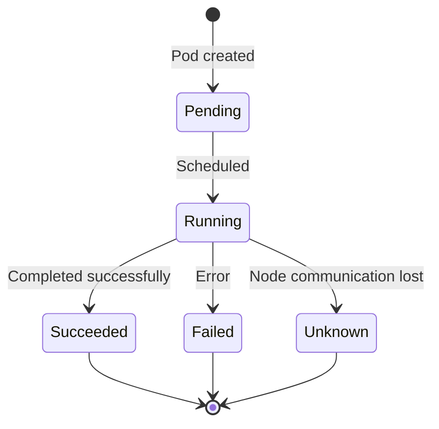
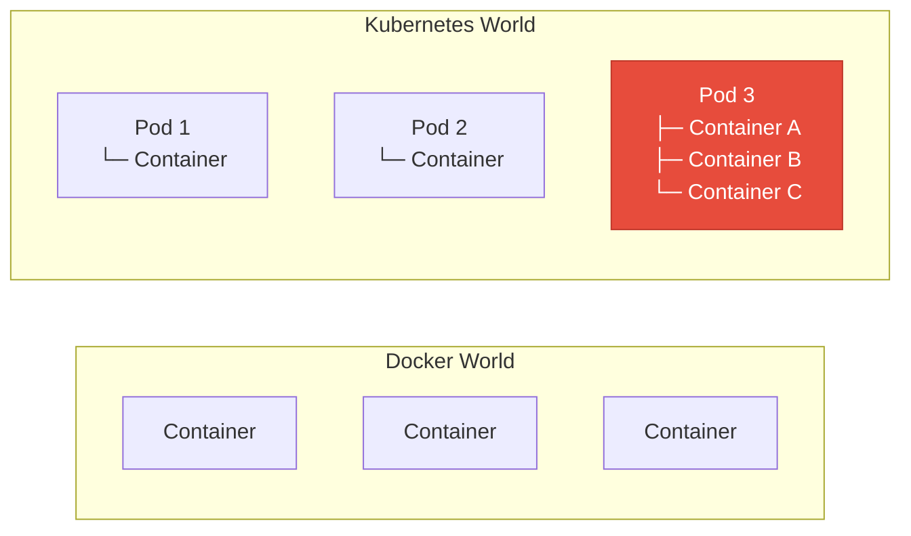

## What is a Pod?

A **Pod** is the smallest deployable unit in Kubernetes. It's a logical group of one or more containers that:

- Share the same network (IP address)
- Share the same storage (volumes)
- Always run together on the same node

---

## Pod Structure

<div class="diagram-container">

</div>

---

## Single Container vs Multi-Container Pod

<div class="concept-box">
<strong>Single Container (Most Common):</strong> One container per pod. Simple and clean.<br><br>
<strong>Multi-Container (Sidecar Pattern):</strong> Main app + helper (logging, monitoring, proxy).
</div>

### Sidecar Example

```
┌─────────────────────────────────────┐
│              POD                    │
├─────────────────────────────────────┤
│  ┌──────────────┐  ┌──────────────┐ │
│  │   Web App    │  │   Log Shipper│ │
│  │  (Container) │  │  (Container) │ │
│  │              │  │              │ │
│  │  Writes logs │◄─┤  Reads logs  │ │
│  │  to /logs    │  │  sends to    │ │
│  │              │  │  Elasticsearch│ │
│  └──────────────┘  └──────────────┘ │
│                                    │
│     Shared Volume: /logs          │
└─────────────────────────────────────┘
```

---

## Pod YAML Example

```yaml
apiVersion: v1
kind: Pod
metadata:
  name: nginx-pod
  labels:
    app: nginx
    env: production
spec:
  containers:
  - name: nginx
    image: nginx:1.25
    ports:
    - containerPort: 80
    resources:
      requests:
        memory: "64Mi"
        cpu: "250m"
      limits:
        memory: "128Mi"
        cpu: "500m"
    volumeMounts:
    - name: html
      mountPath: /usr/share/nginx/html
  volumes:
  - name: html
    emptyDir: {}
```

---

## Pod Lifecycle

<div class="diagram-container">

</div>

| State | Description |
|-------|-------------|
| **Pending** | Pod accepted, but containers not created yet |
| **Running** | At least one container is running |
| **Succeeded** | All containers terminated successfully |
| **Failed** | At least one container terminated with error |
| **Unknown** | State of pod couldn't be obtained |

---

## Pod vs Container

<div class="diagram-container">

</div>

<div class="concept-box">
<strong>Key Difference:</strong> K8s doesn't schedule containers - it schedules PODS. Containers inside a pod are always together.
</div>

---

## Common Pod Commands

```bash
# Create a pod
kubectl run nginx --image=nginx

# List pods
kubectl get pods

# Get pod details
kubectl describe pod nginx

# Get pod logs
kubectl logs nginx

# Execute into pod
kubectl exec -it nginx -- /bin/bash

# Delete pod
kubectl delete pod nginx
```

---

## Best Practices

1. **One container per pod** - unless you need sidecars
2. **Always set resource limits** - prevent resource hogging
3. **Use liveness and readiness probes** - health checks
4. **Don't manage pods directly** - use Deployments instead
5. **Labels are key** - for organization and selection

---

## Next: [Deployment](#) - How to manage Pods at scale
