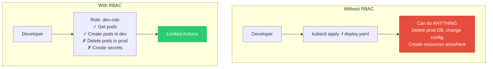
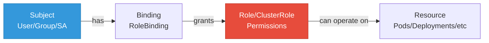
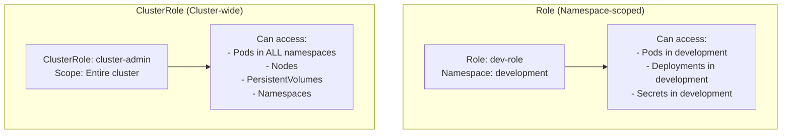

## RBAC (Role-Based Access Control)

**RBAC** controls who can do what in a Kubernetes cluster. It's the authorization system.

---

## Why RBAC?

<div class="diagram-container">

</div>

---

## RBAC Components

<div class="diagram-container">

</div>

| Component | Description |
|-----------|-------------|
| **Subject** | Who? (User, Group, ServiceAccount) |
| **Role** | What permissions? (namespace-scoped) |
| **ClusterRole** | What permissions? (cluster-scoped) |
| **RoleBinding** | Connects Subject to Role (namespace) |
| **ClusterRoleBinding** | Connects Subject to ClusterRole (cluster) |

---

## Role vs ClusterRole

<div class="diagram-container">

</div>

---

## Role YAML

```yaml
apiVersion: rbac.authorization.k8s.io/v1
kind: Role
metadata:
  namespace: development
  name: developer
rules:
- apiGroups: [""]              # Core API (empty string)
  resources: ["pods", "pods/log"]
  verbs: ["get", "list", "watch"]

- apiGroups: ["apps"]
  resources: ["deployments", "replicasets"]
  verbs: ["get", "list", "watch", "create", "update", "patch"]

- apiGroups: [""]
  resources: ["configmaps"]
  verbs: ["get", "list"]
```

**API Groups:**
- `""` - Core (Pod, Service, ConfigMap, etc.)
- `"apps"` - Deployments, StatefulSets, etc.
- `"batch"` - Jobs, CronJobs
- `"networking.k8s.io"` - Ingress, NetworkPolicy

**Verbs:**
- `"get"`, `"list"`, `"watch"` - Read
- `"create"`, `"update"`, `"patch"` - Write
- `"delete"` - Delete
- `"*"` - All

---

## ClusterRole YAML

```yaml
apiVersion: rbac.authorization.k8s.io/v1
kind: ClusterRole
metadata:
  name: cluster-reader
rules:
- apiGroups: [""]
  resources: ["pods", "services", "endpoints"]
  verbs: ["get", "list", "watch"]

- apiGroups: ["apps"]
  resources: ["deployments", "daemonsets", "statefulsets"]
  verbs: ["get", "list", "watch"]

# Cluster-wide resources need ClusterRole
- apiGroups: [""]
  resources: ["nodes", "namespaces", "persistentvolumes"]
  verbs: ["get", "list", "watch"]
```

---

## Built-in ClusterRoles

```bash
# View all clusterroles
kubectl get clusterrole

# Common built-in roles
cluster-admin          # Full access to everything
admin                  # Full access within a namespace
edit                   # Read/write in a namespace (no RBAC)
view                   # Read-only in a namespace
```

---

## RoleBinding

```yaml
apiVersion: rbac.authorization.k8s.io/v1
kind: RoleBinding
metadata:
  name: developer-binding
  namespace: development
subjects:
# User
- kind: User
  name: "alice@example.com"
  apiGroup: rbac.authorization.k8s.io

# ServiceAccount
- kind: ServiceAccount
  name: app-service-account
  namespace: development

# Group
- kind: Group
  name: developers
  apiGroup: rbac.authorization.k8s.io

roleRef:
  kind: Role
  name: developer
  apiGroup: rbac.authorization.k8s.io
```

---

## ClusterRoleBinding

```yaml
apiVersion: rbac.authorization.k8s.io/v1
kind: ClusterRoleBinding
metadata:
  name: cluster-admin-binding
subjects:
- kind: User
  name: "admin@example.com"
  apiGroup: rbac.authorization.k8s.io
roleRef:
  kind: ClusterRole
  name: cluster-admin
  apiGroup: rbac.authorization.k8s.io
```

<div class="concept-box">
<strong>Warning:</strong> cluster-admin gives full access to the entire cluster. Use sparingly!
</div>

---

## ServiceAccount as Subject

```yaml
---
# ServiceAccount
apiVersion: v1
kind: ServiceAccount
metadata:
  name: my-app-sa
  namespace: default

---
# Role
apiVersion: rbac.authorization.k8s.io/v1
kind: Role
metadata:
  name: pod-reader
  namespace: default
rules:
- apiGroups: [""]
  resources: ["pods"]
  verbs: ["get", "list"]

---
# RoleBinding
apiVersion: rbac.authorization.k8s.io/v1
kind: RoleBinding
metadata:
  name: read-pods
  namespace: default
subjects:
- kind: ServiceAccount
  name: my-app-sa
  namespace: default
roleRef:
  kind: Role
  name: pod-reader
  apiGroup: rbac.authorization.k8s.io
```

**Use in pod:**
```yaml
spec:
  serviceAccountName: my-app-sa
```

---

## Aggregated ClusterRoles

```yaml
apiVersion: rbac.authorization.k8s.io/v1
kind: ClusterRole
metadata:
  name: aggregate-readers
aggregationRule:
  clusterRoleSelectors:
  - matchLabels:
      rbac.example.com/aggregate-to-view: "true"
```

Any ClusterRole with the label will be aggregated.

---

## Commands

```bash
# Create role from file
kubectl apply -f role.yaml

# Create role binding
kubectl create rolebinding dev-admin \
  --clusterrole=admin \
  --user=alice@example.com \
  --namespace=development

# Check what user can do
kubectl auth can-i get pods --as=alice@example.com
kubectl auth can-i delete pods --as=alice@example.com

# Check service account permissions
kubectl auth can-i list secrets \
  --as=system:serviceaccount:default:my-app-sa

# View roles and bindings
kubectl get roles -n development
kubectl get rolebindings -n development
kubectl get clusterroles
kubectl get clusterrolebindings
```

---

## Best Practices

1. **Principle of least privilege** - Give minimum needed access
2. **Use namespaces** - Scope roles by namespace
3. **Use ServiceAccounts** - For pods, not users
4. **Regular audits** - Review and clean up unused bindings
5. **Use groups** - Bind to groups, not individual users
6. **Avoid cluster-admin** - Use more specific roles
7. **Document roles** - Clear names for what they do
8. **Test permissions** - Use `kubectl auth can-i`

---

## Common Patterns

### Developer Access

```yaml
# Developer can do anything in dev namespace, read-only in prod
---
kind: RoleBinding
apiVersion: rbac.authorization.k8s.io/v1
metadata:
  name: dev-admin
  namespace: development
subjects:
- kind: Group
  name: developers
roleRef:
  kind: ClusterRole
  name: admin

---
kind: RoleBinding
apiVersion: rbac.authorization.k8s.io/v1
metadata:
  name: dev-view
  namespace: production
subjects:
- kind: Group
  name: developers
roleRef:
  kind: ClusterRole
  name: view
```

### CI/CD Service Account

```yaml
# CI/CD can deploy to specific namespace
---
apiVersion: v1
kind: ServiceAccount
metadata:
  name: cicd-deployer
  namespace: applications

---
apiVersion: rbac.authorization.k8s.io/v1
kind: Role
metadata:
  name: deployer
  namespace: applications
rules:
- apiGroups: ["apps"]
  resources: ["deployments"]
  verbs: ["get", "list", "create", "update", "patch"]

---
apiVersion: rbac.authorization.k8s.io/v1
kind: RoleBinding
metadata:
  name: cicd-deployer
  namespace: applications
subjects:
- kind: ServiceAccount
  name: cicd-deployer
roleRef:
  kind: Role
  name: deployer
```

---

## Troubleshooting

```bash
# Check if user can do something
kubectl auth can-i delete deployments --as=user@example.com

# Check ServiceAccount token (for pods)
kubectl get serviceaccount my-app-sa -o yaml

# View all bindings for a user
kubectl get rolebindings,clusterrolebindings \
  -o jsonpath='{.items[?(@.subjects[*].name=="user@example.com")]}'
```

---

## Summary

```
┌────────────────────────────────────────────────────────────┐
│  Subject ──▶ Binding ──▶ Role ──▶ Permissions              │
│                                                            │
│  User → RoleBinding → Role (namespace)                     │
│  User → ClusterRoleBinding → ClusterRole (cluster)         │
│  Pod → ServiceAccount → RoleBinding → Role                 │
└────────────────────────────────────────────────────────────┘
```

| Component | Scope | Example |
|-----------|-------|---------|
| **Role** | Namespace | Can manage pods in dev |
| **ClusterRole** | Cluster | Can view nodes |
| **RoleBinding** | Namespace | Gives dev role to user |
| **ClusterRoleBinding** | Cluster | Gives cluster-admin to user |

---

## Next: [Storage](#) - PV, PVC, StorageClass
