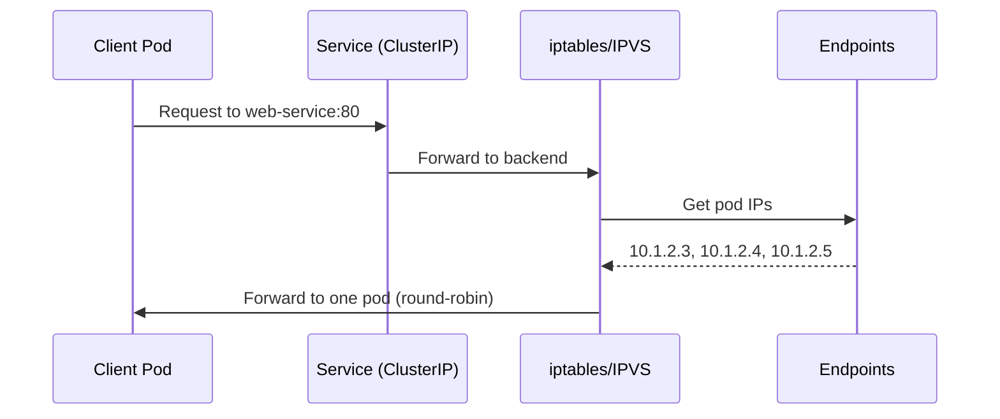

## What is a Service?

A **Service** provides a stable network endpoint (IP/DNS) for a set of Pods. Since Pods have dynamic IPs that change, Services solve the discovery problem.

---

## The Problem Services Solve

<div class="diagram-container">
```mermaid
graph TB
    subgraph "Without Service"
        Client[Client App]
        Pod1[Pod A<br/>IP: 10.1.2.3]
        Pod2[Pod B<br/>IP: 10.1.2.4]

        Client -.->|"hardcoded 10.1.2.3"| Pod1
        Pod1 -.->|"died, new IP: 10.1.2.5"| NewPod[Pod C]
        Client -.->.broken. Broken[❌ Connection failed<br/>IP changed!]
    end

    subgraph "With Service"
        SClient[Client App]
        SVC[Service<br/>IP: 10.96.1.5<br/>DNS: web-service]
        SPod1[Pod A<br/>10.1.2.3]
        SPod2[Pod B<br/>10.1.2.4]
        SPod3[Pod C<br/>10.1.2.5]

        SClient -->|"web-service"| SVC
        SVC -->|"load balance"| SPod1
        SVC -->|"load balance"| SPod2
        SVC -->|"load balance"| SPod3

        style SVC fill:#3498db,stroke:#2980b9,color:#fff
        style Broken fill:#e74c3c,stroke:#c0392b,color:#fff
    end
```
</div>

---

## Service Types

<div class="diagram-container">
```mermaid
graph TB
    subgraph "ClusterIP (Default)"
        direction LR
        CIP[ClusterIP<br/>10.96.1.5]
        CIPClient[Pod inside cluster]
        CIPClient -->|"Can access"| CIP
        Ext[External User] -.->.blocked. Blocked[❌ No access]
    end

    subgraph "NodePort"
        direction LR
        NP[NodePort<br/>NodeIP:30080]
        NPClient[Pod inside cluster]
        NPExt[External User]
        NPClient -->|"ClusterIP or NodePort"| NP
        NPExt -->|"NodeIP:30080"| NP
    end

    subgraph "LoadBalancer"
        direction LR
        LB[LoadBalancer<br/>External IP]
        LBClient[Pod inside cluster]
        LBExt[External User]
        LBClient -->|"Can access"| LB
        LBExt -->|"External IP"| LB
    end

    style CIP fill:#3498db,stroke:#2980b9,color:#fff
    style NP fill:#f39c12,stroke:#e67e22,color:#fff
    style LB fill:#2ecc71,stroke:#27ae60,color:#fff
    style Blocked fill:#e74c3c,stroke:#c0392b,color:#fff
```
</div>

| Type | Description | Use Case |
|------|-------------|----------|
| **ClusterIP** | Internal IP only | Internal services, databases |
| **NodePort** | Exposes on each Node's IP | Testing, development |
| **LoadBalancer** | Cloud load balancer | Production external services |
| **ExternalName** | DNS CNAME | Mapping external services |

---

## Service YAML Examples

### ClusterIP (Default)

```yaml
apiVersion: v1
kind: Service
metadata:
  name: web-service
spec:
  type: ClusterIP
  selector:
    app: nginx                    # Routes to pods with this label
  ports:
  - name: http
    port: 80                      # Service port
    targetPort: 8080              # Container port
```

### NodePort

```yaml
apiVersion: v1
kind: Service
metadata:
  name: web-service
spec:
  type: NodePort
  selector:
    app: nginx
  ports:
  - port: 80
    targetPort: 8080
    nodePort: 30080              # 30000-32767 range
```

### LoadBalancer

```yaml
apiVersion: v1
kind: Service
metadata:
  name: web-service
spec:
  type: LoadBalancer
  selector:
    app: nginx
  ports:
  - port: 80
    targetPort: 8080
```

---

## How Services Work

<div class="diagram-container">

</div>

<div class="concept-box">
<strong>Under the hood:</strong> Services use <code>iptables</code> or <code>IPVS</code> on each node to forward traffic to backend pods. This is handled by <code>kube-proxy</code>.
</div>

---

## Endpoints: The Link to Pods

```
Service: web-service
         │
         ▼
┌─────────────────────────────────┐
│  Endpoints: web-service         │
│  ┌───────────────────────────┐  │
│  │ Addresses:               │  │
│  │  - 10.1.2.3:8080         │  │ ← Pod 1
│  │  - 10.1.2.4:8080         │  │ ← Pod 2
│  │  - 10.1.2.5:8080         │  │ ← Pod 3
│  └───────────────────────────┘  │
└─────────────────────────────────┘
```

---

## Service Discovery: DNS

Kubernetes automatically creates DNS records for services:

```
<service-name>.<namespace>.svc.<cluster-domain>

Example: web-service.default.svc.cluster.local
```

```
┌─────────────────────────────────────────────┐
│  From same namespace:                       │
│  curl http://web-service                   │
│                                             │
│  From different namespace:                  │
│  curl http://web-service.default           │
│                                             │
│  FQDN (always works):                       │
│  curl http://web-service.default.svc.cluster.local│
└─────────────────────────────────────────────┘
```

---

## Headless Services

When you don't need load balancing:

```yaml
apiVersion: v1
kind: Service
metadata:
  name: database-headless
spec:
  type: ClusterIP
  clusterIP: None               # ← Makes it headless
  selector:
    app: database
  ports:
  - port: 5432
```

```
Normal Service:
  DNS → 10.96.1.5 (single IP)

Headless Service:
  DNS → 10.1.2.3, 10.1.2.4, 10.1.2.5 (all pod IPs)
```

**Use cases:** StatefulSet, databases, custom load balancing

---

## Service Commands

```bash
# List services
kubectl get svc

# Get service details
kubectl describe svc web-service

# Get service endpoints
kubectl get endpoints web-service

# Expose deployment as service
kubectl expose deployment nginx --port=80 --type=NodePort

# Delete service
kubectl delete svc web-service
```

---

## Session Affinity

```yaml
apiVersion: v1
kind: Service
metadata:
  name: web-service
spec:
  sessionAffinity: ClientIP
  sessionAffinityConfig:
    clientIP:
      timeoutSeconds: 10800      # 3 hours
```

Ensures requests from same client go to same pod.

---

## Best Practices

1. **Use ClusterIP by default** - most services don't need external access
2. **Don't use NodePort in production** - use LoadBalancer or Ingress
3. **Use descriptive names** - helps with DNS
4. **Set proper selectors** - ensures correct routing
5. **Use headless for stateful apps** - databases, StatefulSets

---

## Summary

| Concept | Purpose |
|---------|---------|
| **Service** | Stable endpoint for dynamic pods |
| **ClusterIP** | Internal cluster access |
| **NodePort** | External access via node IP |
| **LoadBalancer** | External access via cloud LB |
| **Headless** | Direct pod access, no load balancing |
| **DNS** | Service discovery by name |

---

## Next: [Ingress](#) - HTTP/HTTPS routing
