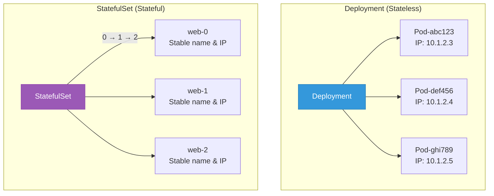
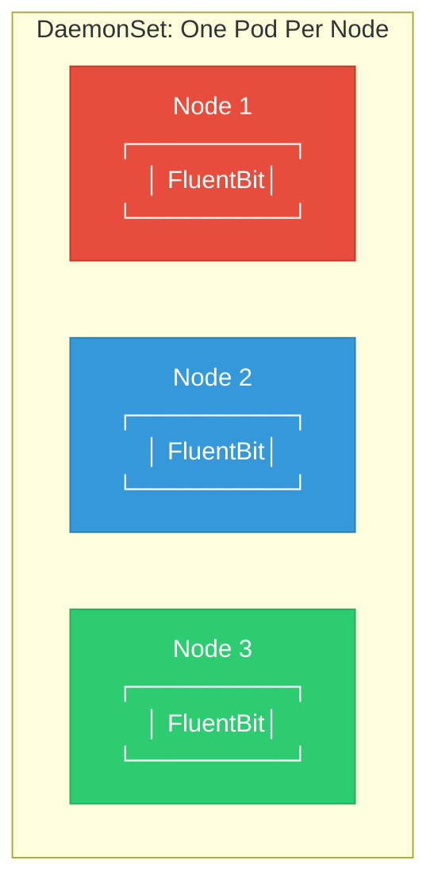

## StatefulSet and DaemonSet

Beyond Deployments, K8s offers specialized workload controllers for specific use cases.

---

## StatefulSet

### What is StatefulSet?

**StatefulSet** manages stateful applications like databases that need:

- Stable network names (not random)
- Stable storage (persistent per pod)
- Ordered deployment and scaling
- Ordered graceful shutdown

<div class="diagram-container">

</div>

---

### StatefulSet Guarantees

| Feature | Deployment | StatefulSet |
|---------|-----------|-------------|
| **Pod names** | Random | Ordered (web-0, web-1, web-2) |
| **Network** | Unstable | Stable DNS per pod |
| **Storage** | Shared or none | Unique PVC per pod |
| **Deployment** | Parallel | Sequential (0→1→2) |
| **Scaling** | Any order | Sequential |
| **Updates** | Any order | Reverse order (2→1→0) |

---

### StatefulSet YAML

```yaml
apiVersion: apps/v1
kind: StatefulSet
metadata:
  name: mongodb
spec:
  serviceName: mongodb        # Headless service required
  replicas: 3
  selector:
    matchLabels:
      app: mongodb
  template:
    metadata:
      labels:
        app: mongodb
    spec:
      containers:
      - name: mongodb
        image: mongo:7
        ports:
        - containerPort: 27017
        volumeMounts:
        - name: data
          mountPath: /data/db
  volumeClaimTemplates:          # Each pod gets unique PVC
  - metadata:
      name: data
    spec:
      accessModes: ["ReadWriteOnce"]
      resources:
        requests:
          storage: 10Gi
```

---

### StatefulSet Pod Identity

```
┌─────────────────────────────────────────────┐
│  StatefulSet: mongodb (replicas: 3)         │
├─────────────────────────────────────────────┤
│                                             │
│  Pod: mongodb-0                            │
│  ├── Hostname: mongodb-0                   │
│  ├── DNS: mongodb-0.mongodb.default.svc    │
│  └── PVC: mongodb-data-mongodb-0           │
│                                             │
│  Pod: mongodb-1                            │
│  ├── Hostname: mongodb-1                   │
│  ├── DNS: mongodb-1.mongodb.default.svc    │
│  └── PVC: mongodb-data-mongodb-1           │
│                                             │
│  Pod: mongodb-2                            │
│  ├── Hostname: mongodb-2                   │
│  ├── DNS: mongodb-2.mongodb.default.svc    │
│  └── PVC: mongodb-data-mongodb-2           │
│                                             │
└─────────────────────────────────────────────┘
```

---

### StatefulSet Scaling

```
Scale up: 3 → 5
┌─────────────────────────────────────────────┐
│  Step 1: Create mongodb-3                  │
│  Step 2: Wait for mongodb-3 ready         │
│  Step 3: Create mongodb-4                  │
│  Step 4: Wait for mongodb-4 ready         │
└─────────────────────────────────────────────┘

Scale down: 5 → 3
┌─────────────────────────────────────────────┐
│  Step 1: Delete mongodb-4                  │
│  Step 2: Wait for mongodb-4 deleted       │
│  Step 3: Delete mongodb-3                  │
│  Step 4: Wait for mongodb-3 deleted       │
└─────────────────────────────────────────────┘
```

---

### Use Cases for StatefulSet

- Databases (MySQL, PostgreSQL, MongoDB)
- Distributed systems (Kafka, ZooKeeper)
- Clusters requiring stable identities
- Applications with unique storage per instance

---

## DaemonSet

### What is DaemonSet?

**DaemonSet** ensures that **all** (or some) nodes run a copy of a pod.

<div class="diagram-container">

</div>

---

### DaemonSet YAML

```yaml
apiVersion: apps/v1
kind: DaemonSet
metadata:
  name: fluentbit
  namespace: kube-system
spec:
  selector:
    matchLabels:
      app: fluentbit
  template:
    metadata:
      labels:
        app: fluentbit
    spec:
      containers:
      - name: fluentbit
        image: fluent/fluent-bit:2.2
        resources:
          limits:
            memory: 200Mi
            cpu: 100m
          requests:
            memory: 100Mi
            cpu: 50m
        volumeMounts:
        - name: varlog
          mountPath: /var/log
      terminationGracePeriodSeconds: 30
      volumes:
      - name: varlog
        hostPath:
          path: /var/log
```

---

### DaemonSet Use Cases

| Use Case | Example |
|----------|---------|
| **Logging** | Fluent Bit, Filebeat |
| **Monitoring** | Node Exporter, cAdvisor |
| **Networking** | CNI plugins (Calico, Weave) |
| **Storage** | Ceph, GlusterFS |

---

### Node Selection

Run only on specific nodes:

```yaml
spec:
  template:
    spec:
      nodeSelector:
        storage: ssd           # Only nodes with storage=ssd label
      tolerations:
      - key: node-role.kubernetes.io/master
        effect: NoSchedule      # Run on master nodes too
```

---

## Comparison Table

<div class="comparison-table">
| Feature | Deployment | StatefulSet | DaemonSet |
|---------|-----------|-------------|-----------|
| **Pod names** | Random | Ordered | N/A |
| **Replicas** | Specified | Specified | 1 per node |
| **Scaling** | Parallel | Sequential | Automatic |
| **Storage** | Shared | Unique per pod | Host path |
| **Use for** | Stateless apps | Databases | Agents/Plugins |
</div>

---

## Commands

```bash
# StatefulSet commands
kubectl get statefulset
kubectl scale statefulset mongodb --replicas=5
kubectl rollout status statefulset mongodb

# DaemonSet commands
kubectl get daemonset
kubectl describe daemonset fluentbit -n kube-system
```

---

## Best Practices

### StatefulSet
1. **Always use headless service** - for stable DNS
2. **Use volumeClaimTemplates** - for unique storage
3. **Don't delete pods directly** - let StatefulSet manage
4. **Plan for upgrades** - reverse order matters

### DaemonSet
1. **Set resource limits** - don't starve pods
2. **Use hostPath carefully** - can cause issues
3. **Update strategy** - OnDelete or RollingUpdate
4. **Node affinity** - control where pods run

---

## Summary

```
┌─────────────────────────────────────────────┐
│  Deployment    →  Stateless apps             │
│  StatefulSet   →  Databases, clusters        │
│  DaemonSet     →  Node agents, monitoring     │
└─────────────────────────────────────────────┘
```

---

## Next: [Job & CronJob](#) - Scheduled workloads
