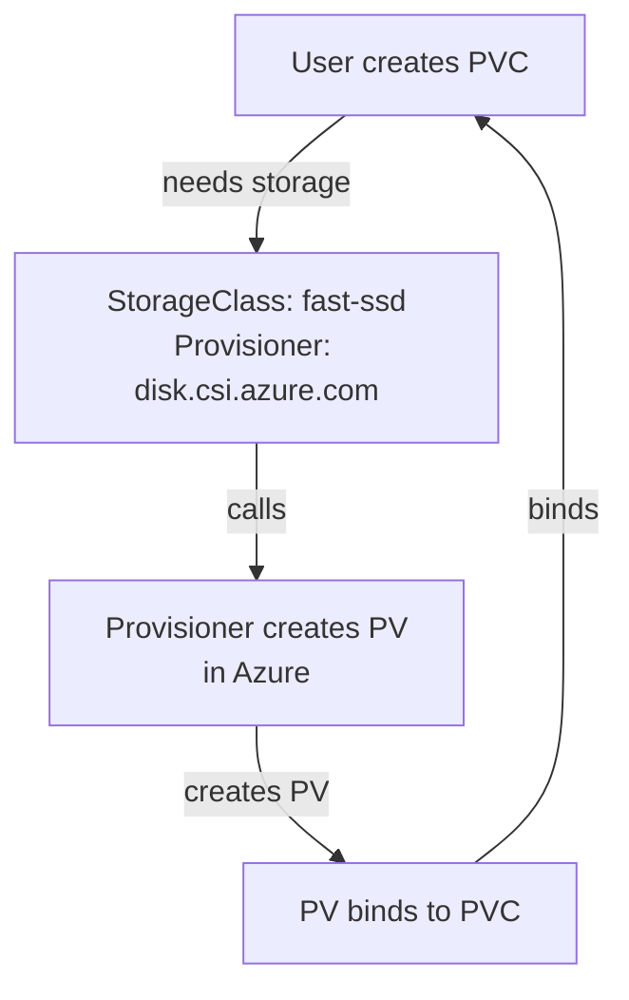
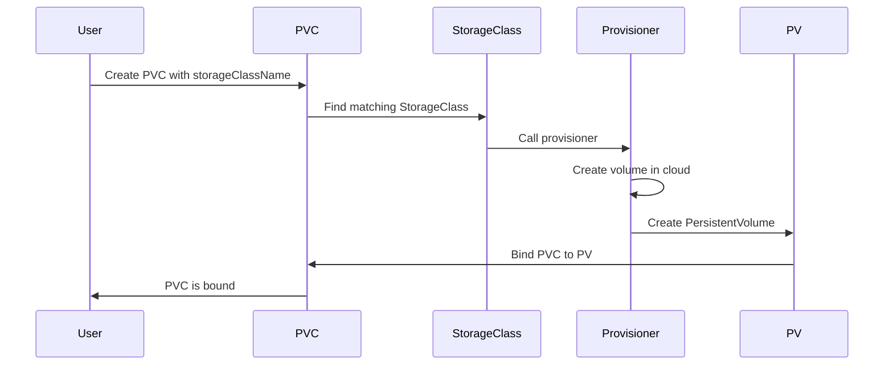

## Kubernetes Storage

Containers are ephemeral, but data needs to persist. K8s provides a robust storage system.

---

## Storage Concepts

<div class="diagram-container">
```mermaid
graph TB
    Pod[Pod<br/>Needs storage]
    PVC[PersistentVolumeClaim<br/>"I need 10GB"]
    PV[PersistentVolume<br/>"I have 10GB disk"]
    SC[StorageClass<br/>"I provision on demand"]

    Pod -->|"mount"| PVC
    PVC -->|"binds to"| PV
    SC -->|"dynamically provisions"| PV

    style Pod fill:#3498db,stroke:#2980b9,color:#fff
    style PVC fill:#e74c3c,stroke:#c0392b,color:#fff
    style PV fill:#f39c12,stroke:#e67e22,color:#fff
    style SC fill:#2ecc71,stroke:#27ae60,color:#fff
```
</div>

| Component | Description |
|-----------|-------------|
| **PV (PersistentVolume)** | Actual storage resource |
| **PVC (PersistentVolumeClaim)** | Request for storage |
| **StorageClass** | Provisioner for dynamic storage |

---

## Volume Types

```
┌─────────────────────────────────────────────────────────────┐
│                    VOLUME TYPES                             │
├─────────────────────────────────────────────────────────────┤
│                                                              │
│   emptyDir           → Empty directory, deleted with pod     │
│   hostPath           → Directory on node (not recommended)  │
│   configMap          → Configuration data                   │
│   secret             → Sensitive data                       │
│   persistentVolumeClaim → Persistent storage (PV)          │
│   nfs                → Network File System                  │
│   azureDisk          → Azure Disk                           │
│   awsElasticBlockStore → AWS EBS volume                    │
│   gcePersistentDisk  → GCP Persistent Disk                 │
│                                                              │
└─────────────────────────────────────────────────────────────┘
```

---

## emptyDir Volume

```yaml
apiVersion: v1
kind: Pod
metadata:
  name: test-pod
spec:
  containers:
  - name: writer
    image: busybox
    command: ["sh", "-c", "echo 'Hello' > /data/test.txt && sleep 3600"]
    volumeMounts:
    - name: data
      mountPath: /data
  - name: reader
    image: busybox
    command: ["sh", "-c", "cat /data/test.txt && sleep 3600"]
    volumeMounts:
    - name: data
      mountPath: /data
  volumes:
  - name: data
    emptyDir:                    # Created when pod starts
      sizeLimit: 100Mi           # Optional size limit
      medium: Memory             # Optional: use tmpfs (RAM)
```

<div class="concept-box">
<strong>Note:</strong> emptyDir is temporary. Data is deleted when pod is deleted.
</div>

---

## PersistentVolume (PV)

### Static PV

```yaml
apiVersion: v1
kind: PersistentVolume
metadata:
  name: pv-example
spec:
  capacity:
    storage: 10Gi
  accessModes:
    - ReadWriteOnce             # RWO
  persistentVolumeReclaimPolicy: Retain
  storageClassName: manual
  hostPath:
    path: /mnt/data              # Use node's directory
```

### PV Access Modes

| Mode | Abbreviation | Description |
|------|--------------|-------------|
| **ReadWriteOnce** | RWO | Single node read/write |
| **ReadOnlyMany** | ROX | Many nodes read-only |
| **ReadWriteMany** | RWX | Many nodes read/write |
| **ReadWriteOncePod** | RWOP | Single pod read/write |

### PV Reclaim Policy

```yaml
persistentVolumeReclaimPolicy: Delete     # Delete PV when PVC deleted
persistentVolumeReclaimPolicy: Retain    # Keep PV data after PVC deleted
persistentVolumeReclaimPolicy: Recycle   # Scrub data (deprecated)
```

---

## PersistentVolumeClaim (PVC)

```yaml
apiVersion: v1
kind: PersistentVolumeClaim
metadata:
  name: pvc-example
spec:
  accessModes:
    - ReadWriteOnce
  resources:
    requests:
      storage: 5Gi                # Request 5GB
  storageClassName: fast-ssd      # Use specific storage class
```

### Using PVC in Pod

```yaml
apiVersion: v1
kind: Pod
metadata:
  name: app-with-storage
spec:
  containers:
  - name: app
    image: nginx
    volumeMounts:
    - name: data
      mountPath: /usr/share/nginx/html
  volumes:
  - name: data
    persistentVolumeClaim:
      claimName: pvc-example      # Reference to PVC
```

---

## StorageClass

### What is StorageClass?

**StorageClass** defines different "types" of storage (fast, slow, SSD, HDD).

<div class="diagram-container">

</div>

### StorageClass YAML

```yaml
apiVersion: storage.k8s.io/v1
kind: StorageClass
metadata:
  name: fast-ssd
provisioner: kubernetes.io/aws-ebs     # AWS EBS provisioner
parameters:
  type: gp3                            # EBS volume type
  iops: "3000"
  throughput: "125"
  encrypted: "true"
volumeBindingMode: WaitForFirstConsumer
allowVolumeExpansion: true
reclaimPolicy: Delete
```

### Common Provisioners

| Provider | Provisioner |
|----------|-------------|
| **AWS** | kubernetes.io/aws-ebs |
| **GCP** | kubernetes.io/gce-pd |
| **Azure** | kubernetes.io/azure-disk |
| **Azure Files** | kubernetes.io/azure-file |
| **NFS** | nfs.csi.k8s.io |
| **Ceph RBD** | rbd.csi.ceph.com |
| **Longhorn** | driver.longhorn.io |

---

## Dynamic Provisioning

<div class="diagram-container">

</div>

```yaml
# 1. Create StorageClass (once)
apiVersion: storage.k8s.io/v1
kind: StorageClass
metadata:
  name: standard
provisioner: kubernetes.io/aws-ebs
parameters:
  type: gp2
volumeBindingMode: Immediate

---
# 2. Create PVC (PV created automatically)
apiVersion: v1
kind: PersistentVolumeClaim
metadata:
  name: dynamic-pvc
spec:
  accessModes:
    - ReadWriteOnce
  storageClassName: standard         # Triggers dynamic provisioning
  resources:
    requests:
      storage: 10Gi
```

---

## Volume Modes

```yaml
apiVersion: v1
kind: PersistentVolume
metadata:
  name: pv-example
spec:
  volumeMode: Filesystem             # Default - mount as filesystem
  # volumeMode: Block               # Raw block device
```

| Mode | Use For |
|------|---------|
| **Filesystem** | Most applications |
| **Block** | Databases needing raw device |

---

## Expanding PVCs

```yaml
apiVersion: storage.k8s.io/v1
kind: StorageClass
metadata:
  name: expandable
provisioner: kubernetes.io/aws-ebs
allowVolumeExpansion: true          # Allow expansion
```

```bash
# Edit PVC to request more storage
kubectl edit pvc data-pvc

# Change spec.resources.requests.storage from 10Gi to 20Gi

# Check status
kubectl get pvc data-pvc
# NAME      STATUS   VOLUME                                     CAPACITY   ACCESS MODES
# data-pvc  Bound    pvc-12345678-1234-1234-1234-123456789012   20Gi       RWO
```

---

## StatefulSet with PVC Template

```yaml
apiVersion: apps/v1
kind: StatefulSet
metadata:
  name: mongo
spec:
  serviceName: mongo
  replicas: 3
  selector:
    matchLabels:
      app: mongo
  template:
    metadata:
      labels:
        app: mongo
    spec:
      containers:
      - name: mongo
        image: mongo:7
        volumeMounts:
        - name: data
          mountPath: /data/db
  volumeClaimTemplates:              # Each pod gets unique PVC
  - metadata:
      name: data
    spec:
      accessModes: ["ReadWriteOnce"]
      storageClassName: fast-ssd
      resources:
        requests:
          storage: 10Gi
```

Result:
```
mongo-0 → PVC: data-mongo-0
mongo-1 → PVC: data-mongo-1
mongo-2 → PVC: data-mongo-2
```

---

## Commands

```bash
# List PVCs
kubectl get pvc

# List PVs
kubectl get pv

# List storage classes
kubectl get sc

# Get PVC details
kubectl describe pvc data-pvc

# Delete PVC (data behavior depends on reclaimPolicy)
kubectl delete pvc data-pvc

# Resize PVC (if StorageClass allows)
kubectl patch pvc data-pvc -p '{"spec":{"resources":{"requests":{"storage":"20Gi"}}}}'
```

---

## Best Practices

1. **Use StorageClass** - Let K8s provision storage automatically
2. **Set resource requests** - Define needed storage
3. **Choose correct access mode** - RWO vs RWX
4. **Set reclaim policy** - Delete or Retain based on data importance
5. **Monitor storage usage** - Set up alerts
6. **Use appropriate storage class** - SSD for databases, HDD for logs
7. **Backup important data** - K8s doesn't backup PVs automatically

---

## Summary

```
┌────────────────────────────────────────────────────────────┐
│  StorageClass  →  Defines storage types                    │
│       │                                                     │
│       ▼                                                     │
│  PVC           →  Requests storage                         │
│       │                                                     │
│       ▼                                                     │
│  PV            →  Actual storage (provisioned or manual)    │
│       │                                                     │
│       ▼                                                     │
│  Pod           →  Mounts PVC as volume                     │
└────────────────────────────────────────────────────────────┘
```

| Component | Real-world Analogy |
|-----------|-------------------|
| **PVC** | Purchase order: "I need 10GB" |
| **PV** | Warehouse: "Here's 10GB disk" |
| **StorageClass** | Catalog: "Fast SSD $0.10/GB" |

---

## Next: [Taints & Tolerations](#) - Scheduling control
