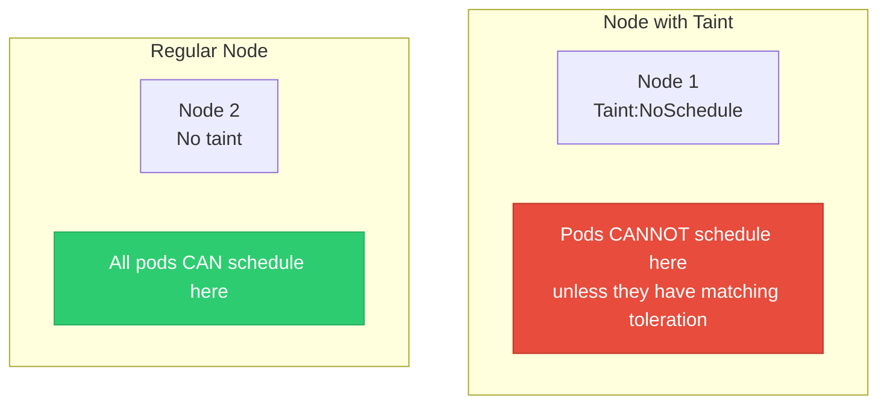
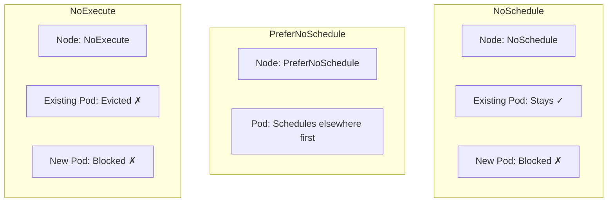
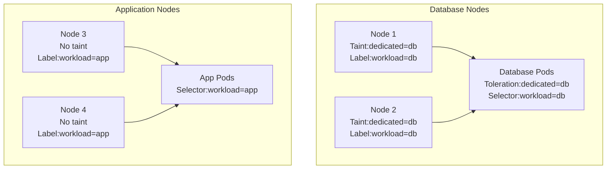

## Taints and Tolerations

**Taints** and **Tolerations** control which pods can be scheduled on which nodes.

---

## The Concept

<div class="diagram-container">

</div>

<div class="concept-box">
<strong>Analogy:</strong><br>
<strong>Taint</strong> = "Do Not Enter" sign on a node<br>
<strong>Toleration</strong> = A special key that lets a pod enter anyway
</div>

---

## Taint on Node

```bash
# Add taint to node
kubectl taint nodes node1 key=value:NoSchedule

# Remove taint
kubectl taint nodes node1 key:NoSchedule-

# View taints
kubectl describe node node1 | grep Taints
```

## Taint Effects

| Effect | Description | Repels |
|--------|-------------|---------|
| **NoSchedule** | Pod without toleration can't schedule | New pods |
| **PreferNoSchedule** | Scheduler tries to avoid | New pods (soft) |
| **NoExecute** | Evicts existing pods without toleration | Existing + new |

---

## Effect Examples

<div class="diagram-container">

</div>

---

## Toleration on Pod

```yaml
apiVersion: v1
kind: Pod
metadata:
  name: my-pod
spec:
  containers:
  - name: app
    image: nginx
  tolerations:
  - key: "key"
    operator: "Equal"
    value: "value"
    effect: "NoSchedule"
```

---

## Toleration Operators

| Operator | Matches When |
|----------|-------------|
| **Equal** | key=value match |
| **Exists** | key exists (value ignored) |

```yaml
# Equal: needs exact match
tolerations:
- key: "dedicated"
  operator: "Equal"
  value: "database"
  effect: "NoSchedule"

# Exists: matches any value or no value
tolerations:
- key: "dedicated"
  operator: "Exists"
  effect: "NoSchedule"

# Exists with any effect
tolerations:
- operator: "Exists"
```

---

## Use Cases

### 1. Dedicated Nodes

```yaml
# Taint database nodes
kubectl taint nodes node1 node2 dedicated=database:NoSchedule

# Pod with toleration
apiVersion: apps/v1
kind: Deployment
metadata:
  name: postgres
spec:
  template:
    spec:
      tolerations:
      - key: dedicated
        value: database
        effect: NoSchedule
      nodeSelector:
        workload: database
```

### 2. GPU Nodes

```yaml
# Taint GPU nodes
kubectl taint nodes gpu-node1 nvidia.com/gpu=true:NoSchedule

# Only GPU pods can use these nodes
spec:
  tolerations:
  - key: nvidia.com/gpu
    operator: Exists
    effect: NoSchedule
```

### 3. Master Nodes

```bash
# Master nodes are tainted by default
# kubernetes.io/master:NoSchedule

# System pods tolerate this taint
# Your custom pods won't schedule on master
```

### 4. Spot/Preemptible Nodes

```yaml
# Spot nodes have special taint
kubectl taint nodes spot-node1 cloud.google.com/gke-preemptible=true:NoExecute

# Pod tolerates it (and can be evicted)
spec:
  tolerations:
  - key: cloud.google.com/gke-preemptible
    operator: Equal
    value: "true"
    effect: NoExecute
  tolerationSeconds: 300          # Graceful shutdown time
```

---

## Toleration Seconds (NoExecute only)

```yaml
tolerations:
- key: "key"
  operator: "Equal"
  value: "value"
  effect: "NoExecute"
  tolerationSeconds: 3600         # Stay for 1 hour after taint added
```

---

## Multiple Tolerations

```yaml
tolerations:
- key: "dedicated"
  operator: "Equal"
  value: "database"
  effect: "NoSchedule"

- key: "node-type"
  operator: "Equal"
  value: "ssd"
  effect: "NoSchedule"

- operator: "Exists"              # Tolerate everything
```

---

## Common Taints

| Taint | Purpose |
|-------|---------|
| `node-role.kubernetes.io/master` | Control plane nodes |
| `node.kubernetes.io/not-ready` | Node not ready |
| `node.kubernetes.io/unreachable` | Node unreachable |
| `node.kubernetes.io/memory-pressure` | Low memory |
| `node.kubernetes.io/disk-pressure` | Low disk |
| `nvidia.com/gpu=true` | GPU nodes |
| `cloud.google.com/gke-preemptible=true` | GKE spot nodes |

---

## Real Example: Dedicated Database Nodes

<div class="diagram-container">

</div>

```yaml
# Setup
kubectl taint nodes node1 dedicated=db:NoSchedule
kubectl taint nodes node2 dedicated=db:NoSchedule
kubectl label nodes node1 node2 workload=db

kubectl label nodes node3 node4 workload=app

---
# Database deployment
apiVersion: apps/v1
kind: Deployment
metadata:
  name: database
spec:
  template:
    spec:
      tolerations:
      - key: dedicated
        value: db
        effect: NoSchedule
      nodeSelector:
        workload: db

---
# App deployment
apiVersion: apps/v1
kind: Deployment
metadata:
  name: app
spec:
  template:
    spec:
      nodeSelector:
        workload: app
      # No tolerations needed - no taint on app nodes
```

---

## Commands

```bash
# Taint a node
kubectl taint nodes node1 key=value:NoSchedule

# Remove taint
kubectl taint nodes node1 key:NoSchedule-

# Check node taints
kubectl describe node node1 | grep Taints

# Check pod tolerations
kubectl get pod my-pod -o yaml | grep -A5 tolerations
```

---

## Taint vs NodeSelector

| Feature | Taint | NodeSelector |
|---------|-------|-------------|
| **Applied to** | Node | Pod |
| **Purpose** | Repel unwanted pods | Attract wanted pods |
| **Default** | All pods allowed | All nodes allowed |
| **Together** | Use both for strict placement | |

```
Best practice: Use both!

┌─────────────────────────────────────────────┐
│  1. Taint nodes                              │
│  2. Add labels to nodes                      │
│  3. Set tolerations on pods                  │
│  4. Set nodeSelector on pods                 │
└─────────────────────────────────────────────┘
```

---

## Best Practices

1. **Always label nodes** - For nodeSelector affinity
2. **Use with nodeSelector** - Taint repels, selector attracts
3. **Document taints** - Why is this node tainted?
4. **Review built-in taints** - Master node taints
5. **Test tolerations** - Ensure pods can schedule
6. **Use NoExecute carefully** - It evicts running pods

---

## Summary

```
┌────────────────────────────────────────────────────────────┐
│  TAINT (on Node)      =  "Keep Out" sign                   │
│  TOLERATION (on Pod)  =  "I have permission"               │
│                                                            │
│  Without matching toleration = Pod cannot schedule         │
└────────────────────────────────────────────────────────────┘
```

| Effect | Existing Pods | New Pods |
|--------|---------------|----------|
| **NoSchedule** | Stay | Blocked |
| **PreferNoSchedule** | Stay | Avoid if possible |
| **NoExecute** | Evicted (or stay with grace) | Blocked |

---

## End of Kubernetes Basics!

Congratulations! You've learned all the core K8s concepts. Continue practicing with real clusters.

**Next Steps:**
- Set up a local cluster (minikube, kind, k3d)
- Deploy a real application
- Explore advanced topics (Operators, Service Mesh)
