# Kubernetes: From Zero to Production

A complete guide to understanding Kubernetes — the container orchestration platform that powers modern infrastructure. Whether you're just starting out or looking to deepen your knowledge, this guide takes you from "what is Kubernetes?" to production-ready patterns.

## Why This Guide?

Kubernetes has become the de facto standard for container orchestration. But learning it can feel overwhelming — there are so many concepts, so much YAML, and so many ways to do things.

This guide combines everything you need to know into one comprehensive resource, organized logically to build your knowledge step by step.

---

## Table of Contents

1. [Kubernetes Overview](#overview) — Architecture and Components
2. [Pod](#pod) — The Smallest Deployable Unit
3. [Deployment](#deployment) — Managing Pods at Scale
4. [Service](#service) — Networking and Service Discovery
5. [ConfigMap & Secret](#config) — Configuration Management
6. [Ingress](#ingress) — HTTP/HTTPS Routing
7. [StatefulSet & DaemonSet](#statefulset) — Specialized Workloads
8. [Job & CronJob](#job) — Batch and Scheduled Tasks
9. [Network Policy](#network-policy) — Traffic Control
10. [RBAC](#rbac) — Access Control and Security
11. [HPA](#hpa) — Horizontal Pod Autoscaling
12. [Storage](#storage) — Persistent Volumes and Claims
13. [Taints & Tolerations](#taints) — Pod Scheduling

---

<a id="overview"></a>
# 1. Kubernetes Overview

## What is Kubernetes?

Kubernetes (K8s) is an open-source container orchestration platform that automates deployment, scaling, and management of containerized applications.

### Why K8s?

<div class="concept-box">
<strong>The Problem:</strong> You have 100 containers running across multiple servers. One dies. How do you know? How do you replace it? How do you scale when traffic spikes?<br><br>
<strong>The Solution:</strong> Kubernetes handles all of this automatically.
</div>

## K8s Architecture

<div class="diagram-container">
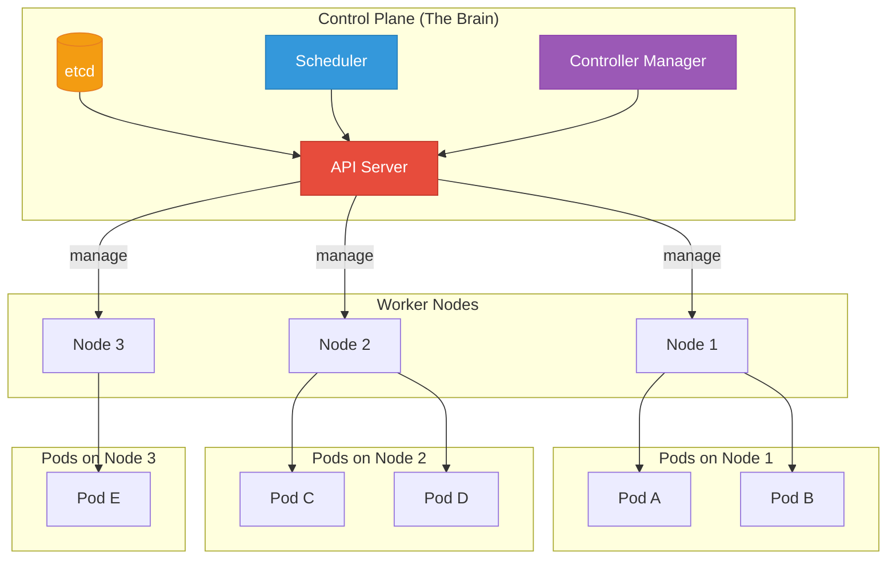
</div>

## Control Plane Components

| Component | Responsibility |
|-----------|----------------|
| **API Server** | Frontend to K8s, validates config |
| **etcd** | Key-value store, cluster state |
| **Scheduler** | Decides which node runs pods |
| **Controller Manager** | Maintains desired state |
| **Cloud Controller** | Integrates with cloud providers |

## Worker Node Components

| Component | Responsibility |
|-----------|----------------|
| **kubelet** | Agent on each node, talks to API server |
| **kube-proxy** | Network rules, service discovery |
| **Container Runtime** | Runs containers (Docker, containerd) |

## K8s Does For You

- ✅ **Self-healing**: Restarts failed containers
- ✅ **Auto-scaling**: Adds/removes pods based on load
- ✅ **Load balancing**: Distributes traffic across pods
- ✅ **Rolling updates**: Zero-downtime deployments
- ✅ **Rollback**: Revert to previous version if something breaks
- ✅ **Secret management**: Securely stores passwords/keys
- ✅ **Storage orchestration**: Mounts storage volumes

---

<a id="pod"></a>
# 2. Pod: The Smallest Unit

## What is a Pod?

A **Pod** is the smallest deployable unit in Kubernetes. It's a logical group of one or more containers that:

- Share the same network (IP address)
- Share the same storage (volumes)
- Always run together on the same node

## Pod Structure

<div class="diagram-container">
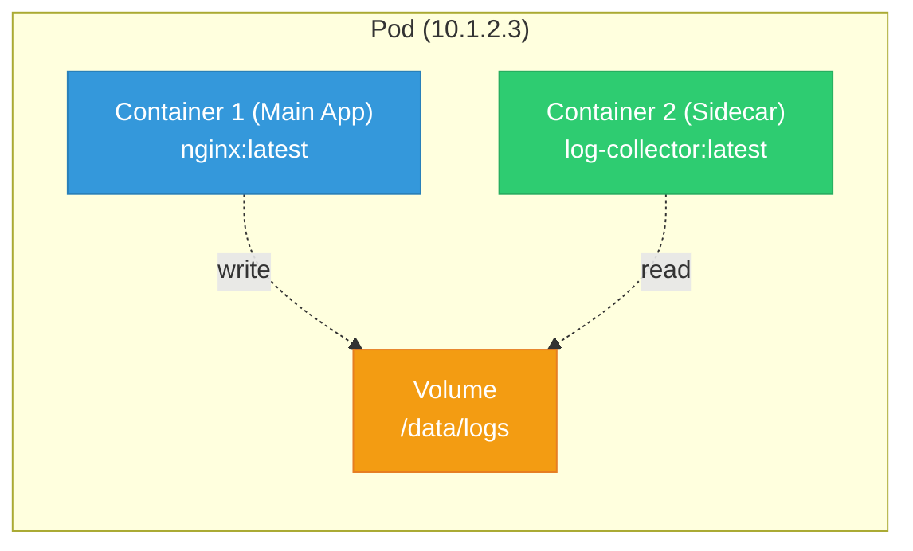
</div>

## Single Container vs Multi-Container Pod

<div class="concept-box">
<strong>Single Container (Most Common):</strong> One container per pod. Simple and clean.<br><br>
<strong>Multi-Container (Sidecar Pattern):</strong> Main app + helper (logging, monitoring, proxy).
</div>

### Sidecar Example

```
┌─────────────────────────────────────┐
│              POD                    │
├─────────────────────────────────────┤
│  ┌──────────────┐  ┌──────────────┐ │
│  │   Web App    │  │   Log Shipper│ │
│  │  (Container) │  │  (Container) │ │
│  │              │  │              │ │
│  │  Writes logs │◄─┤  Reads logs  │ │
│  │  to /logs    │  │  sends to    │ │
│  │              │  │  Elasticsearch│ │
│  └──────────────┘  └──────────────┘ │
│                                    │
│     Shared Volume: /logs          │
└─────────────────────────────────────┘
```

## Pod YAML Example

```yaml
apiVersion: v1
kind: Pod
metadata:
  name: nginx-pod
  labels:
    app: nginx
    env: production
spec:
  containers:
  - name: nginx
    image: nginx:1.25
    ports:
    - containerPort: 80
    resources:
      requests:
        memory: "64Mi"
        cpu: "250m"
      limits:
        memory: "128Mi"
        cpu: "500m"
    volumeMounts:
    - name: html
      mountPath: /usr/share/nginx/html
  volumes:
  - name: html
    emptyDir: {}
```

## Pod Lifecycle

<div class="diagram-container">
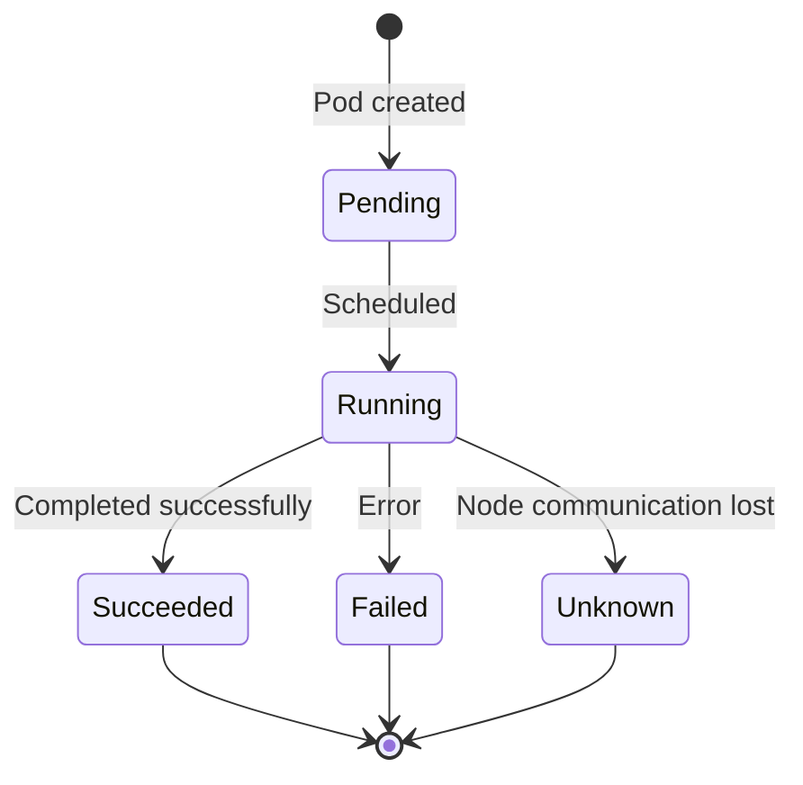
</div>

| State | Description |
|-------|-------------|
| **Pending** | Pod accepted, but containers not created yet |
| **Running** | At least one container is running |
| **Succeeded** | All containers terminated successfully |
| **Failed** | At least one container terminated with error |
| **Unknown** | State of pod couldn't be obtained |

## Pod vs Container

<div class="diagram-container">
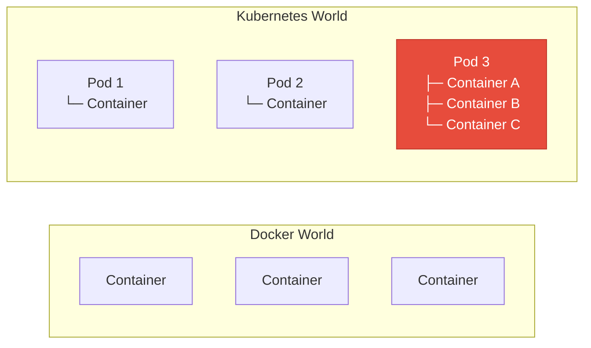
</div>

<div class="concept-box">
<strong>Key Difference:</strong> K8s doesn't schedule containers - it schedules PODS. Containers inside a pod are always together.
</div>

## Common Pod Commands

```bash
# Create a pod
kubectl run nginx --image=nginx

# List pods
kubectl get pods

# Get pod details
kubectl describe pod nginx

# Get pod logs
kubectl logs nginx

# Execute into pod
kubectl exec -it nginx -- /bin/bash

# Delete pod
kubectl delete pod nginx
```

## Best Practices

1. **One container per pod** — unless you need sidecars
2. **Always set resource limits** — prevent resource hogging
3. **Use liveness and readiness probes** — health checks
4. **Don't manage pods directly** — use Deployments instead
5. **Labels are key** — for organization and selection

---

<a id="deployment"></a>
# 3. Deployment: Managing Pods at Scale

## What is a Deployment?

A **Deployment** manages a set of identical Pods. It ensures:

- A specified number of pods are running
- Pods are healthy and restarted if they fail
- Rolling updates with zero downtime
- Rollback to previous versions

## Deployment vs Pod

<div class="diagram-container">
```mermaid
graph TB
    subgraph "Managing Pods Directly (Don't do this!)"
        Manual[Manual Pod Management<br/>kubectl run pod1<br/>kubectl run pod2<br/>kubectl run pod3]
        Manual -.->.hard. Hard[❌ Hard to scale<br/>❌ No self-healing<br/>❌ No rolling updates]
    end

    subgraph "Using Deployment (Do this!)"
        Deploy[Deployment: 3 replicas]
        Deploy --> Pod1[Pod 1]
        Deploy --> Pod2[Pod 2]
        Deploy --> Pod3[Pod 3]
        Deploy -.->.good. Good[✓ Easy scaling<br/>✓ Auto self-healing<br/>✓ Rolling updates]
    end

    style Deploy fill:#3498db,stroke:#2980b9,color:#fff
    style Manual fill:#e74c3c,stroke:#c0392b,color:#fff
```
</div>

## Deployment YAML

```yaml
apiVersion: apps/v1
kind: Deployment
metadata:
  name: nginx-deployment
  labels:
    app: nginx
spec:
  replicas: 3                    # Want 3 pods
  selector:
    matchLabels:
      app: nginx                 # Must match pod labels
  template:                      # Pod template
    metadata:
      labels:
        app: nginx
    spec:
      containers:
      - name: nginx
        image: nginx:1.25
        ports:
        - containerPort: 80
```

## How Deployment Works

<div class="diagram-container">
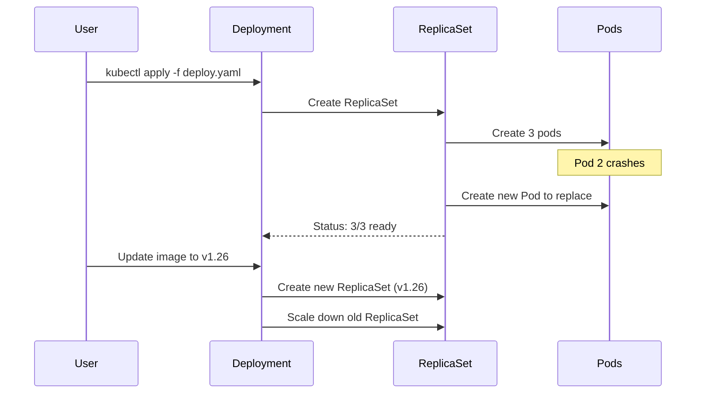
</div>

## Rolling Update Strategy

<div class="diagram-container">
```mermaid
graph LR
    subgraph "Rolling Update Process"
        direction TB
        Old[Old Pods: v1.25<br/>● ● ● ●]
        Step1[Step 1: Start new pods<br/>● ● ● ●<br/>○ ○]
        Step2[Step 2: Terminate old<br/>● ● ●<br/>○ ○ ○]
        Step3[Step 3: Continue...<br/>● ●<br/>○ ○ ○]
        Step4[Step 4: Complete<br/>○ ○ ○ ○<br/>(New: v1.26)]
    end

    style Old fill:#e74c3c,stroke:#c0392b,color:#fff
    style Step4 fill:#2ecc71,stroke:#27ae60,color:#fff
```
</div>

```yaml
spec:
  replicas: 5
  strategy:
    type: RollingUpdate
    rollingUpdate:
      maxSurge: 2        # Can create 2 extra pods during update
      maxUnavailable: 1  # At most 1 pod can be down
```

## Deployment Commands

```bash
# Create deployment
kubectl create deployment nginx --image=nginx:1.25

# Scale up/down
kubectl scale deployment nginx --replicas=5

# Update image (triggers rolling update)
kubectl set image deployment/nginx nginx=nginx:1.26

# Check rollout status
kubectl rollout status deployment/nginx

# View rollout history
kubectl rollout history deployment/nginx

# Rollback to previous version
kubectl rollout undo deployment/nginx

# Rollback to specific version
kubectl rollout undo deployment/nginx --to-revision=2
```

## Deployment States

| State | Description |
|-------|-------------|
| **Progressing** | Deployment is creating/replicating pods |
| **Complete** | All pods are updated and healthy |
| **Failed** | Deployment couldn't complete (progress deadline exceeded) |

## ReplicaSet: Behind the Scenes

<div class="concept-box">
<strong>Deployment creates ReplicaSet, ReplicaSet creates Pods.</strong><br><br>
You rarely interact with ReplicaSets directly. The Deployment manages them for you.
</div>

```
Deployment (nginx-deployment)
    │
    ├── ReplicaSet (nginx-deployment-7d64c5d9f9)  ← Old version
    │   └── Pods: nginx-deployment-7d64c5d9f9-abc123
    │
    └── ReplicaSet (nginx-deployment-5f8c6d9b7c)  ← New version
         └── Pods: nginx-deployment-5f8c6d9b7c-xyz789
```

## Best Practices

1. **Always use Deployments** — not bare Pods
2. **Set resource requests/limits** — for proper scheduling
3. **Use health checks** — liveness and readiness probes
4. **Configure rolling updates** — set maxSurge and maxUnavailable
5. **Tag your images properly** — use specific tags, not `latest`
6. **Test rollbacks** — make sure you can revert quickly

## Common Issues

### Issue: Pods not ready

```bash
kubectl describe deployment nginx
kubectl describe pod <pod-name>
kubectl logs <pod-name>
```

### Issue: Rollout stuck

```bash
kubectl rollout undo deployment/nginx
```

## Comparison: Deployment vs StatefulSet

| Feature | Deployment | StatefulSet |
|---------|-----------|-------------|
| **Pod names** | Random | Ordered (web-0, web-1) |
| **Storage** | Shared PVC | Unique PVC per pod |
| **Scaling** | Any order | Sequential |
| **Use for** | Stateless apps | Databases, clusters |

---

<a id="service"></a>
# 4. Service: Networking Basics

## What is a Service?

A **Service** provides a stable network endpoint (IP/DNS) for a set of Pods. Since Pods have dynamic IPs that change, Services solve the discovery problem.

## The Problem Services Solve

<div class="diagram-container">
```mermaid
graph TB
    subgraph "Without Service"
        Client[Client App]
        Pod1[Pod A<br/>IP: 10.1.2.3]
        Pod2[Pod B<br/>IP: 10.1.2.4]

        Client -.->|"hardcoded 10.1.2.3"| Pod1
        Pod1 -.->|"died, new IP: 10.1.2.5"| NewPod[Pod C]
        Client -.->.broken. Broken[❌ Connection failed<br/>IP changed!]
    end

    subgraph "With Service"
        SClient[Client App]
        SVC[Service<br/>IP: 10.96.1.5<br/>DNS: web-service]
        SPod1[Pod A<br/>10.1.2.3]
        SPod2[Pod B<br/>10.1.2.4]
        SPod3[Pod C<br/>10.1.2.5]

        SClient -->|"web-service"| SVC
        SVC -->|"load balance"| SPod1
        SVC -->|"load balance"| SPod2
        SVC -->|"load balance"| SPod3

        style SVC fill:#3498db,stroke:#2980b9,color:#fff
        style Broken fill:#e74c3c,stroke:#c0392b,color:#fff
    end
```
</div>

## Service Types

<div class="diagram-container">
```mermaid
graph TB
    subgraph "ClusterIP (Default)"
        direction LR
        CIP[ClusterIP<br/>10.96.1.5]
        CIPClient[Pod inside cluster]
        CIPClient -->|"Can access"| CIP
        Ext[External User] -.->.blocked. Blocked[❌ No access]
    end

    subgraph "NodePort"
        direction LR
        NP[NodePort<br/>NodeIP:30080]
        NPClient[Pod inside cluster]
        NPExt[External User]
        NPClient -->|"ClusterIP or NodePort"| NP
        NPExt -->|"NodeIP:30080"| NP
    end

    subgraph "LoadBalancer"
        direction LR
        LB[LoadBalancer<br/>External IP]
        LBClient[Pod inside cluster]
        LBExt[External User]
        LBClient -->|"Can access"| LB
        LBExt -->|"External IP"| LB
    end

    style CIP fill:#3498db,stroke:#2980b9,color:#fff
    style NP fill:#f39c12,stroke:#e67e22,color:#fff
    style LB fill:#2ecc71,stroke:#27ae60,color:#fff
    style Blocked fill:#e74c3c,stroke:#c0392b,color:#fff
```
</div>

| Type | Description | Use Case |
|------|-------------|----------|
| **ClusterIP** | Internal IP only | Internal services, databases |
| **NodePort** | Exposes on each Node's IP | Testing, development |
| **LoadBalancer** | Cloud load balancer | Production external services |
| **ExternalName** | DNS CNAME | Mapping external services |

## Service YAML Examples

### ClusterIP (Default)

```yaml
apiVersion: v1
kind: Service
metadata:
  name: web-service
spec:
  type: ClusterIP
  selector:
    app: nginx                    # Routes to pods with this label
  ports:
    - name: http
      port: 80                      # Service port
      targetPort: 8080              # Container port
```

### NodePort

```yaml
apiVersion: v1
kind: Service
metadata:
  name: web-service
spec:
  type: NodePort
  selector:
    app: nginx
  ports:
    - port: 80
    targetPort: 8080
    nodePort: 30080              # 30000-32767 range
```

### LoadBalancer

```yaml
apiVersion: v1
kind: Service
metadata:
  name: web-service
spec:
  type: LoadBalancer
  selector:
    app: nginx
  ports:
    - port: 80
    targetPort: 8080
```

## How Services Work

<div class="diagram-container">
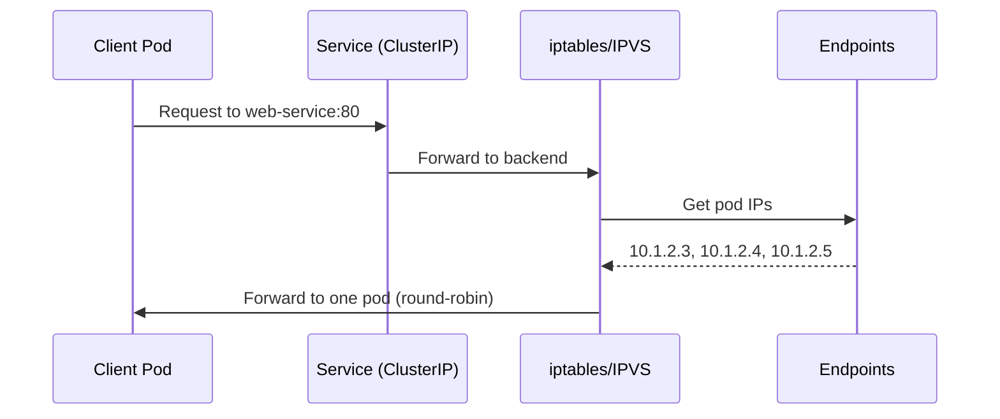
</div>

<div class="concept-box">
<strong>Under the hood:</strong> Services use <code>iptables</code> or <code>IPVS</code> on each node to forward traffic to backend pods. This is handled by <code>kube-proxy</code>.
</div>

## Endpoints: The Link to Pods

```
Service: web-service
         │
         ▼
┌─────────────────────────────────┐
│  Endpoints: web-service         │
│  ┌───────────────────────────┐  │
│  │ Addresses:               │  │
│  │  - 10.1.2.3:8080         │  │ ← Pod 1
│  │  - 10.1.2.4:8080         │  │ ← Pod 2
│  │  - 10.1.2.5:8080         │  │ ← Pod 3
│  └───────────────────────────┘  │
└─────────────────────────────────┘
```

## Service Discovery: DNS

Kubernetes automatically creates DNS records for services:

```
<service-name>.<namespace>.svc.<cluster-domain>

Example: web-service.default.svc.cluster.local
```

```
┌─────────────────────────────────────────────┐
│  From same namespace:                       │
│  curl http://web-service                   │
│                                             │
│  From different namespace:                  │
│  curl http://web-service.default           │
│                                             │
│  FQDN (always works):                       │
│  curl http://web-service.default.svc.cluster.local│
└─────────────────────────────────────────────┘
```

## Headless Services

When you don't need load balancing:

```yaml
apiVersion: v1
kind: Service
metadata:
  name: database-headless
spec:
  type: ClusterIP
  clusterIP: None               # ← Makes it headless
  selector:
    app: database
  ports:
    - port: 5432
```

```
Normal Service:
  DNS → 10.96.1.5 (single IP)

Headless Service:
  DNS → 10.1.2.3, 10.1.2.4, 10.1.2.5 (all pod IPs)
```

**Use cases:** StatefulSet, databases, custom load balancing

## Service Commands

```bash
# List services
kubectl get svc

# Get service details
kubectl describe svc web-service

# Get service endpoints
kubectl get endpoints web-service

# Expose deployment as service
kubectl expose deployment nginx --port=80 --type=NodePort

# Delete service
kubectl delete svc web-service
```

## Session Affinity

```yaml
apiVersion: v1
kind: Service
metadata:
  name: web-service
spec:
  sessionAffinity: ClientIP
  sessionAffinityConfig:
    clientIP:
      timeoutSeconds: 10800      # 3 hours
```

Ensures requests from same client go to same pod.

## Best Practices

1. **Use ClusterIP by default** — most services don't need external access
2. **Don't use NodePort in production** — use LoadBalancer or Ingress
3. **Use descriptive names** — helps with DNS
4. **Set proper selectors** — ensures correct routing
5. **Use headless for stateful apps** — databases, StatefulSets

---

<a id="config"></a>
# 5. ConfigMap & Secret: Configuration in Kubernetes

## ConfigMap and Secret

These two resources help you separate configuration from container images, following the 12-factor app methodology.

## ConfigMap vs Secret

<div class="diagram-container">
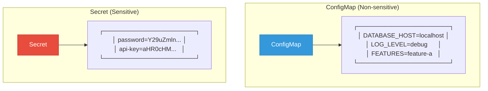
</div>

| Feature | ConfigMap | Secret |
|---------|-----------|--------|
| **Data** | Plain text | Base64 encoded |
| **Usage** | Non-sensitive config | Passwords, keys, tokens |
| **Etcd storage** | Plain | Can be encrypted at rest |
| **Visibility** | Anyone with cluster access | Restricted by RBAC |

## ConfigMap

### Creating ConfigMap

```yaml
apiVersion: v1
kind: ConfigMap
metadata:
  name: app-config
data:
  # Key-value pairs
  DATABASE_HOST: "postgres.default.svc.cluster.local"
  DATABASE_PORT: "5432"
  LOG_LEVEL: "info"
  FEATURES: "feature-a,feature-b,feature-c"

  # Multi-line config file
  nginx.conf: |
    server {
      listen 80;
      location / {
        proxy_pass http://backend:8080;
      }
    }
```

### Using ConfigMap

#### 1. As Environment Variables

```yaml
apiVersion: v1
kind: Pod
metadata:
  name: app-pod
spec:
  containers:
    - name: app
      image: myapp:latest
      env:
        # Single key
        - name: DATABASE_HOST
          valueFrom:
            configMapKeyRef:
              name: app-config
              key: DATABASE_HOST

        # All keys as env vars
      envFrom:
        - configMapRef:
            name: app-config
```

#### 2. As Volume Mount

```yaml
apiVersion: v1
kind: Pod
metadata:
  name: app-pod
spec:
  containers:
    - name: app
      image: myapp:latest
      volumeMounts:
        - name: config
          mountPath: /etc/config
          readOnly: true
  volumes:
    - name: config
    configMap:
      name: app-config
```

Result in container:
```
/etc/config/
├── DATABASE_HOST     → "postgres.default.svc.cluster.local"
├── DATABASE_PORT     → "5432"
├── LOG_LEVEL        → "info"
├── FEATURES         → "feature-a,feature-b,feature-c"
└── nginx.conf       → (multi-line content)
```

## Secret

### Creating Secret

```yaml
apiVersion: v1
kind: Secret
metadata:
  name: app-secret
type: Opaque
data:
  # Values must be base64 encoded
  password: cGFzc3dvcmQxMjM=           # "password123"
  api-key: YXBpLWtleS1zZWNyZXQ=       # "api-key-secret"
```

**Encode values:**
```bash
echo -n "password123" | base64
# Output: cGFzc3dvcmQxMjM=
```

### Using Secret

#### As Environment Variables

```yaml
apiVersion: v1
kind: Pod
metadata:
  name: app-pod
spec:
  containers:
    - name: app
      image: myapp:latest
      env:
        - name: DB_PASSWORD
          valueFrom:
            secretKeyRef:
              name: app-secret
              key: password
      envFrom:
        - secretRef:
              name: app-secret
```

#### As Volume Mount

```yaml
apiVersion: v1
kind: Pod
metadata:
  name: app-pod
spec:
  containers:
    - name: app
      image: myapp:latest
      volumeMounts:
        - name: secret
          mountPath: /etc/secrets
          readOnly: true
  volumes:
    - name: secret
    secret:
      secretName: app-secret
```

## Secret Types

| Type | Description |
|------|-------------|
| **Opaque** | Arbitrary user data (default) |
| **kubernetes.io/service-account-token** | Service account token |
| **kubernetes.io/dockerconfigjson** | Docker registry auth |
| **kubernetes.io/basic-auth** | Basic authentication |
| **kubernetes.io/ssh-auth** | SSH authentication |
| **kubernetes.io/tls** | TLS certificate data |
| **bootstrap.kubernetes.io/token** | Bootstrap token |

### TLS Secret Example

```yaml
apiVersion: v1
kind: Secret
metadata:
  name: tls-cert
type: kubernetes.io/tls
data:
  tls.crt: <base64-encoded-cert>
  tls.key: <base64-encoded-key>
```

## Immutable ConfigMap/Secret

```yaml
apiVersion: v1
kind: ConfigMap
metadata:
  name: app-config
immutable: true    # Cannot be changed after creation
data:
  LOG_LEVEL: "info"
```

**Benefits:**
- Improves performance (no watches)
- Prevents accidental changes
- Required for Pod anti-affinity with large configs

## Commands

```bash
# Create ConfigMap from literal
kubectl create configmap app-config --from-literal=LOG_LEVEL=debug

# Create ConfigMap from file
kubectl create configmap nginx-config --from-file=nginx.conf

# Create ConfigMap from directory
kubectl create configmap app-config --from-file=./config/

# Create Secret from literal
kubectl create secret generic app-secret --from-literal=password=secret123

# Create Secret from file
kubectl create secret generic tls-cert --from-file=tls.crt --from-file=tls.key

# Create Secret from docker registry
kubectl create secret docker-registry regcred \
  --docker-server=registry.example.com \
  --docker-username=user \
  --docker-password=pass

# Get ConfigMap
kubectl get configmap app-config -o yaml

# Get Secret (decoded)
kubectl get secret app-secret -o jsonpath='{.data.password}' | base64 -d
```

## Best Practices

1. **Never store secrets in ConfigMaps** — use Secret
2. **Don't commit secrets to Git** — use sealed-secrets or external secret managers
3. **Use immutable when possible** — better performance
4. **Version your configs** — use git for ConfigMaps
5. **Use volume mounts for files** — env vars for simple values
6. **Encode secrets properly** — use `echo -n | base64`
7. **Rotate secrets regularly** — automate secret rotation
8. **Use external secret managers** — Vault, AWS Secrets Manager, etc.

---

<a id="ingress"></a>
# 6. Ingress: HTTP/HTTPS Routing

## What is Ingress?

**Ingress** manages external access to services in a cluster, typically HTTP/HTTPS. It provides:

- Host-based routing (api.example.com, web.example.com)
- Path-based routing (/api, /web, /admin)
- TLS termination (HTTPS)
- Load balancing
- Advanced features (auth, rate limiting, rewriting)

## Ingress vs Service

<div class="diagram-container">
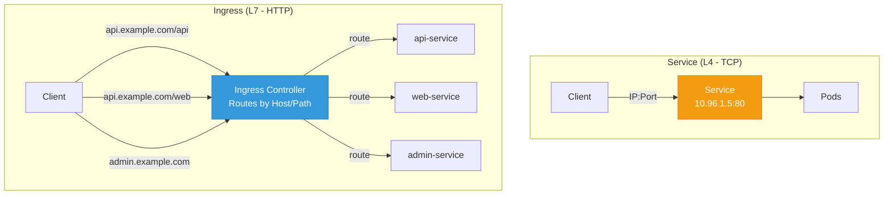
</div>

| Feature | Service | Ingress |
|---------|---------|---------|
| **Layer** | L4 (TCP/UDP) | L7 (HTTP/HTTPS) |
| **Routing** | IP:Port | Host, Path, Headers |
| **TLS** | Passthrough | Termination |
| **Rules** | None | Complex routing |

## How Ingress Works

<div class="diagram-container">
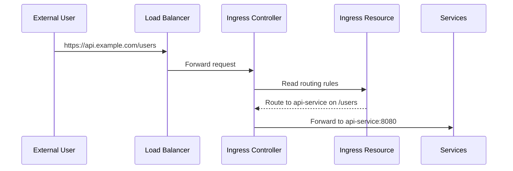
</div>

## Ingress Components

<div class="diagram-container">
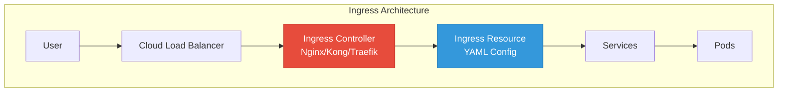
</div>

**Two parts needed:**

1. **Ingress Controller** - The server that processes rules (Nginx, Kong, Traefik, GKE Ingress)
2. **Ingress Resource** - YAML defining routing rules

## Ingress YAML

```yaml
apiVersion: networking.k8s.io/v1
kind: Ingress
metadata:
  name: web-ingress
  annotations:
    nginx.ingress.kubernetes.io/rewrite-target: /
    cert-manager.io/cluster-issuer: letsencrypt-prod
spec:
  ingressClassName: nginx
  tls:
    - hosts:
    - api.example.com
    secretName: api-tls
  rules:
    - host: api.example.com
    http:
      paths:
        - path: /api
        pathType: Prefix
        backend:
          service:
            name: api-service
            port:
              number: 8080
      - path: /
        pathType: Prefix
        backend:
          service:
            name: web-service
            port:
              number: 80
```

## Path Types

<div class="diagram-container">
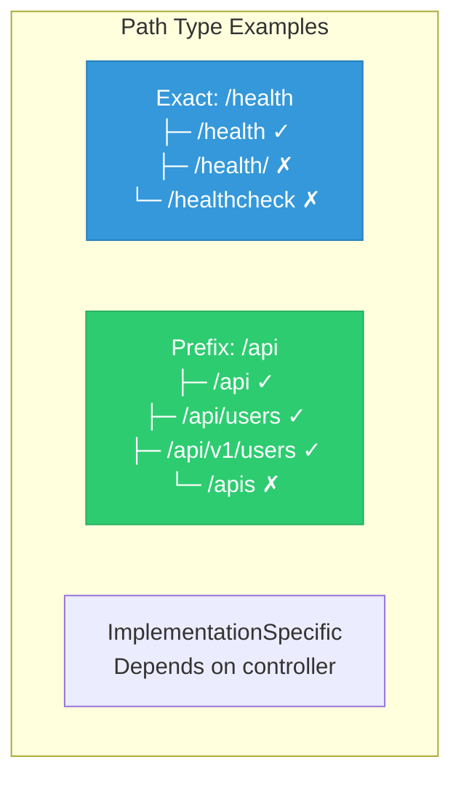
</div>

| Type | Description | Use For |
|------|-------------|---------|
| **Exact** | Must match exactly | Health checks, specific endpoints |
| **Prefix** | Matches path and everything below | General API routes |
| **ImplementationSpecific** | Controller-dependent | Special features |

## Ingress Controllers

| Controller | Description |
|------------|-------------|
| **Nginx** | Most popular, feature-rich |
| **Kong** | API Gateway with plugins |
| **Traefik** | Auto-discovery, modern |
| **GKE Ingress** | Google Cloud managed |
| **AWS ALB** | AWS Application Load Balancer |
| **Contour** | Envoy-based |

## Multiple Hosts Example

```yaml
apiVersion: networking.k8s.io/v1
kind: Ingress
metadata:
  name: multi-host-ingress
spec:
  ingressClassName: nginx
  rules:
    - host: api.example.com
      http:
        paths:
          - path: /
            pathType: Prefix
            backend:
              service:
                name: api-service
                port:
                  number: 8080
    - host: web.example.com
      http:
        paths:
          - path: /
            pathType: Prefix
            backend:
              service:
                name: web-service
                port:
                  number: 80
```

## Best Practices

1. **Use TLS everywhere** — enable HTTPS
2. **Separate controllers** — internal vs external
3. **Use path types correctly** — Exact vs Prefix
4. **Set up cert-manager** — automatic TLS certificates
5. **Monitor ingress** — logs, metrics
6. **Use annotations wisely** — controller-specific

---

<a id="statefulset"></a>
# 7. StatefulSet and DaemonSet: Specialized Workloads

Beyond Deployments, K8s offers specialized workload controllers for specific use cases.

## StatefulSet

### What is StatefulSet?

**StatefulSet** manages stateful applications like databases that need:

- Stable network names (not random)
- Stable storage (persistent per pod)
- Ordered deployment and scaling
- Ordered graceful shutdown

<div class="diagram-container">
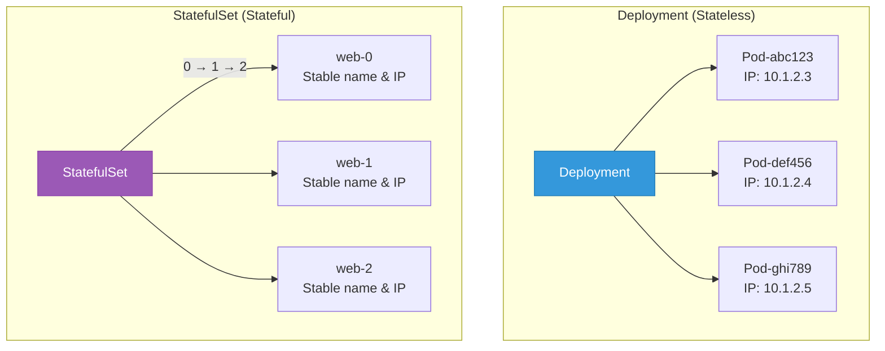
</div>

### StatefulSet Guarantees

| Feature | Deployment | StatefulSet |
|---------|-----------|-------------|
| **Pod names** | Random | Ordered (web-0, web-1, web-2) |
| **Network** | Unstable | Stable DNS per pod |
| **Storage** | Shared or none | Unique PVC per pod |
| **Deployment** | Parallel | Sequential (0→1→2) |
| **Scaling** | Any order | Sequential |
| **Updates** | Any order | Reverse order (2→1→0) |

### StatefulSet YAML

```yaml
apiVersion: apps/v1
kind: StatefulSet
metadata:
  name: mongodb
spec:
  serviceName: mongodb        # Headless service required
  replicas: 3
  selector:
    matchLabels:
      app: mongodb
  template:
    metadata:
      labels:
        app: mongodb
    spec:
      containers:
      - name: mongodb
        image: mongo:7
        ports:
        - containerPort: 27017
        volumeMounts:
        - name: data
          mountPath: /data/db
    volumeClaimTemplates:          # Each pod gets unique PVC
    - metadata:
      name: data
    spec:
      accessModes: ["ReadWriteOnce"]
      resources:
        requests:
          storage: 10Gi
```

### StatefulSet Pod Identity

```
┌─────────────────────────────────────────────┐
│  StatefulSet: mongodb (replicas: 3)         │
├─────────────────────────────────────────────┤
│                                             │
│  Pod: mongodb-0                            │
│  ├── Hostname: mongodb-0                   │
│  ├── DNS: mongodb-0.mongodb.default.svc    │
│  └── PVC: mongodb-data-mongodb-0           │
│                                             │
│  Pod: mongodb-1                            │
│  ├── Hostname: mongodb-1                   │
│  ├── DNS: mongodb-1.mongodb.default.svc    │
│  └── PVC: mongodb-data-mongodb-1           │
│                                             │
│  Pod: mongodb-2                            │
│  ├── Hostname: mongodb-2                   │
│  ├── DNS: mongodb-2.mongodb.default.svc    │
│  └── PVC: mongodb-data-mongodb-2           │
│                                             │
└─────────────────────────────────────────────┘
```

### Use Cases for StatefulSet

- Databases (MySQL, PostgreSQL, MongoDB)
- Distributed systems (Kafka, ZooKeeper)
- Clusters requiring stable identities
- Applications with unique storage per instance

## DaemonSet

### What is DaemonSet?

**DaemonSet** ensures that **all** (or some) nodes run a copy of a pod.

<div class="diagram-container">
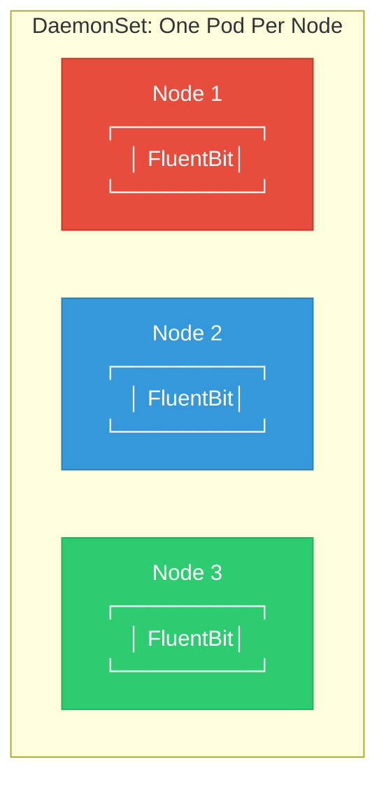
</div>

### DaemonSet YAML

```yaml
apiVersion: apps/v1
kind: DaemonSet
metadata:
  name: fluentbit
  namespace: kube-system
spec:
  selector:
    matchLabels:
      app: fluentbit
  template:
    metadata:
      labels:
        app: fluentbit
    spec:
      containers:
      - name: fluentbit
        image: fluent/fluent-bit:2.2
        resources:
          limits:
            memory: 200Mi
            cpu: 100m
          requests:
            memory: 100Mi
            cpu: 50m
        volumeMounts:
        - name: varlog
          mountPath: /var/log
      terminationGracePeriodSeconds: 30
      volumes:
      - name: varlog
        hostPath:
          path: /var/log
```

### DaemonSet Use Cases

| Use Case | Example |
|----------|---------|
| **Logging** | Fluent Bit, Filebeat |
| **Monitoring** | Node Exporter, cAdvisor |
| **Networking** | CNI plugins (Calico, Weave) |
| **Storage** | Ceph, GlusterFS |

## Comparison Table

<div class="comparison-table">
| Feature | Deployment | StatefulSet | DaemonSet |
|---------|-----------|-------------|-----------|
| **Pod names** | Random | Ordered | N/A |
| **Replicas** | Specified | Specified | 1 per node |
| **Scaling** | Parallel | Sequential | Automatic |
| **Storage** | Shared | Unique per pod | Host path |
| **Use for** | Stateless apps | Databases | Agents/Plugins |
</div>

---

<a id="job"></a>
# 8. Job & CronJob: Scheduled Workloads

For batch processing and scheduled tasks, K8s provides Jobs and CronJobs instead of Deployments.

## Job

### What is a Job?

A **Job** creates one or more pods and ensures they **complete successfully**. Unlike Deployments, Jobs are for tasks that finish.

<div class="diagram-container">
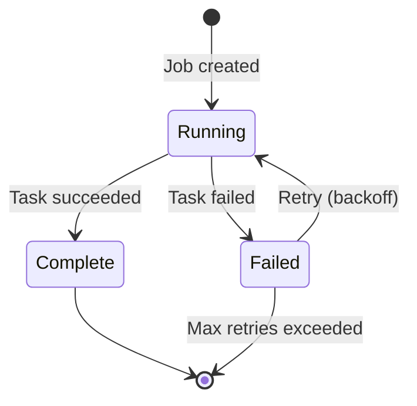
</div>

### Job Types

<div class="diagram-container">
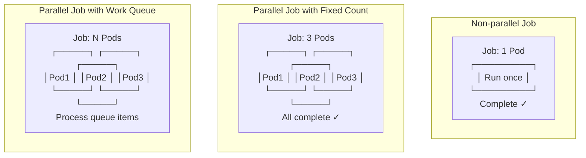
</div>

### Job YAML Examples

#### Single Pod Job

```yaml
apiVersion: batch/v1
kind: Job
metadata:
  name: backup-job
spec:
  template:
    spec:
      containers:
      - name: backup
        image: backup-tool:v1
        command: ["./backup.sh"]
        restartPolicy: Never      # Jobs use Never or OnFailure
      backoffLimit: 4                # Retry 4 times on failure
```

#### Parallel Job

```yaml
apiVersion: batch/v1
kind: Job
metadata:
  name: parallel-job
spec:
  completions: 5                # Need 5 successful completions
  parallelism: 2                # Run 2 pods in parallel
  template:
    spec:
      containers:
      - name: worker
        image: worker:v1
        command: ["./process.sh"]
      restartPolicy: OnFailure
```

Timeline:
├── Pod 1 starts
├── Pod 2 starts
├── Pod 1 completes (1/5 done)
├── Pod 3 starts
└── ...until 5 completions

## CronJob

### What is CronJob?

A **CronJob** runs Jobs on a schedule (like cron).

<div class="diagram-container">
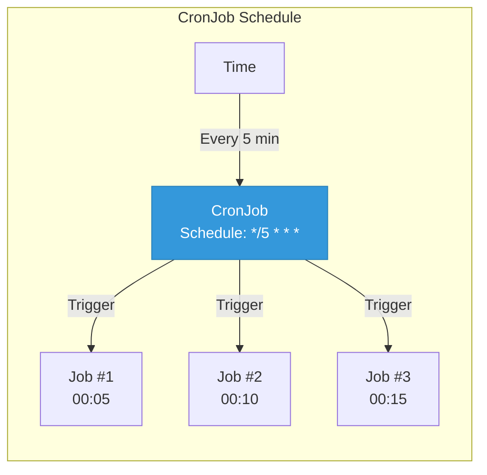
</div>

### CronJob YAML

```yaml
apiVersion: batch/v1
kind: CronJob
metadata:
  name: backup-cronjob
spec:
  schedule: "0 2 * * *"           # 2 AM every day
  successfulJobsHistoryLimit: 3    # Keep last 3 successful
  failedJobsHistoryLimit: 1        # Keep last 1 failed
  concurrencyPolicy: Forbid        # Don't overlap
  startingDeadlineSeconds: 300     # Skip if missed by 5 min
  jobTemplate:
    spec:
      template:
        spec:
          containers:
          - name: backup
            image: backup-tool:v1
            command:
              - /bin/bash
              - -c
              - |
                echo "Starting backup at $(date)"
                ./backup.sh
                echo "Backup completed at $(date)"
          restartPolicy: OnFailure
```

### Cron Schedule Format

```
┌─────────────┬─────────────┬─────────────┬─────────────┬─────────────┐
│   Minute    │    Hour     │     Day     │    Month    │   Day of    │
│  (0-59)     │   (0-23)    │   (1-31)    │   (1-12)    │   Week      │
│             │             │             │             │             │
├─────────────┼─────────────┼─────────────┼─────────────┼─────────────┤
│      *      │      *      │      *      │      *      │      *     │
│  Any minute │   Any hour  │  Any day    │  Any month  │ Any weekday│
└─────────────┴─────────────┴─────────────┴─────────────┴─────────────┘
```

| Schedule | Description |
|----------|-------------|
| `0 * * * *` | Every hour at minute 0 |
| `*/15 * * *` | Every 15 minutes |
| `0 2 * * *` | 2 AM every day |
| `0 0 * * 0` | Midnight every Sunday |
| `0 0 1 * *` | Midnight on 1st of month |
| `0 */6 * * *` | Every 6 hours |
| `0 9-17 * * 1-5` | Every hour 9AM-5PM, Mon-Fri |

## Best Practices

1. **Set resource limits** — jobs can consume lots of resources
2. **Use activeDeadlineSeconds** — prevent hanging jobs
3. **Set ttlSecondsAfterFinished** — auto-cleanup old jobs
4. **Set history limits** — don't clutter etcd
5. **Use concurrencyPolicy** — control overlapping jobs
6. **Monitor job completion** — set up alerts
7. **Handle failures** — set appropriate backoffLimit

---

<a id="network-policy"></a>
# 9. Network Policy: Traffic Control

**Network Policy** controls traffic flow between pods at the IP address level. It's like a firewall within Kubernetes.

## Why Network Policy?

<div class="diagram-container">
```mermaid
graph TB
    subgraph "Without Network Policy"
        Any[Pod A<br/>Can talk to<br/>ANYONE]
        Any -.->.all. All[Pod B, Pod C, Pod D<br/>Internet, Database<br/>Everything reachable]
    end

    subgraph "With Network Policy"
        A[Pod A<br/>Frontend]
        B[Pod B<br/>Backend]
        DB[(Database)]
        Ext[External API]

        A -->|"Allowed"| B
        B -->|"Allowed"| DB
        A -.->.blocked. X1[Database - Blocked]
        B -.->.blocked. X2[External API - Blocked]
    end

    style All fill:#e74c3c,stroke:#c0392b,color:#fff
    style X1 fill:#e74c3c,stroke:#c0392b,color:#fff
    style X2 fill:#e74c3c,stroke:#c0392b,color:#fff
```
</div>

<div class="concept-box">
<strong>Default behavior:</strong> All pods can talk to all pods (and external).<br><br>
<strong>With NetworkPolicy:</strong> Default deny, explicit allow.
</div>

## Policy Structure

```yaml
apiVersion: networking.k8s.io/v1
kind: NetworkPolicy
metadata:
  name: example-policy
spec:
  podSelector:              # Which pods this applies to
    matchLabels:
      app: backend
  policyTypes:
    - Ingress                 # Incoming traffic rules
    - Egress                  # Outgoing traffic rules
```

## Ingress Policy (Incoming Traffic)

### Allow from specific pods

```yaml
apiVersion: networking.k8s.io/v1
kind: NetworkPolicy
metadata:
  name: backend-policy
spec:
  podSelector:
    matchLabels:
      app: backend
  policyTypes:
    - Ingress
    ingress:
    - from:
      - podSelector:
          matchLabels:
            app: frontend           # Only frontend can connect
      ports:
        - protocol: TCP
          port: 8080
```

### Allow from specific namespace

```yaml
ingress:
- from:
  - namespaceSelector:
      matchLabels:
        name: production        # Only pods in production namespace
  - podSelector:
      matchLabels:
        app: frontend
```

### Allow from specific IP block

```yaml
ingress:
- from:
  - ipBlock:
      cidr: 10.0.0.0/8         # Only from 10.0.0.0/8
  ports:
    - protocol: TCP
      port: 443
```

## Egress Policy (Outgoing Traffic)

### Allow DNS only

```yaml
apiVersion: networking.k8s.io/v1
kind: NetworkPolicy
metadata:
  name: allow-dns-only
spec:
  podSelector:
    matchLabels:
      app: backend
  policyTypes:
    - Egress
  egress:
    - to:
      - namespaceSelector:
          matchLabels:
            k8s-app: kube-dns     # CoreDNS
    ports:
      - protocol: UDP
      port: 53
```

## Full Example: Frontend-Backend-DB

<div class="diagram-container">
```mermaid
graph TB
    FE[Frontend Pods<br/>app=frontend]
    BE[Backend Pods<br/>app=backend]
    DB[(Database Pods<br/>app=database)]

    FE -->|"Allowed"| BE
    BE -->|"Allowed"| DB
    FE -.->.blocked. X1[Database - Blocked]
    DB -.->.blocked. X2[Internet - Blocked]

    style X1 fill:#e74c3c,stroke:#c0392b,color:#fff
    style X2 fill:#e74c3c,stroke:#c0392b,color:#fff
```
</div>

```yaml
---
# Backend policy
apiVersion: networking.k8s.io/v1
kind: NetworkPolicy
metadata:
  name: backend-policy
spec:
  podSelector:
    matchLabels:
      app: backend
  policyTypes:
    - Ingress
    - Egress
  ingress:
    - from:
      - podSelector:
          matchLabels:
            app: frontend           # Only frontend
      ports:
        - protocol: TCP
          port: 8080
  egress:
      - to:                           # Allow to database
    - podSelector:
          matchLabels:
            app: database
      ports:
        - protocol: TCP
          port: 5432
  - to:                           # Allow DNS
    - namespaceSelector:
          matchLabels:
            k8s-app: kube-dns
    ports:
      - protocol: UDP
          port: 53
```

# Database policy
apiVersion: networking.k8s.io/v1
kind: NetworkPolicy
metadata:
  name: database-policy
spec:
  podSelector:
    matchLabels:
      app: database
  policyTypes:
    - Ingress
    ingress:
    - from:
      - podSelector:
          matchLabels:
            app: backend           # Only backend
      ports:
        - protocol: TCP
          port: 5432
```

## Best Practices

1. **Start with deny-all** — then explicitly allow
2. **Use namespace labels** — for multi-tenant isolation
3. **Document policies** — use clear names and comments
4. **Test thoroughly** — verify connectivity after applying
5. **Monitor hits** — use logs to see policy in action
6. **Use labels effectively** — for pod selection
7. **Separate ingress/egress** — for clarity

---

<a id="rbac"></a>
# 10. RBAC: Access Control

## RBAC (Role-Based Access Control)

**RBAC** controls who can do what in a Kubernetes cluster. It's the authorization system.

## Why RBAC?

<div class="diagram-container">
```mermaid
graph TB
    subgraph "Without RBAC"
        Dev[Developer]
        Kubectl[kubectl apply -f deploy.yaml]
        Anything[Can do ANYTHING<br/>Delete prod DB, change config<br/>Create resources anywhere]
        Dev --> Kubectl
        Kubectl --> Anything
    end

    subgraph "With RBAC"
        Dev2[Developer]
        Role[Role: dev-role<br/>✓ Get pods<br/>✓ Create pods in dev<br/>✗ Delete pods in prod<br/>✗ Create secrets]
        Limit[Limited Actions]
        Dev2 --> Role
        Role --> Limit
    end

    style Anything fill:#e74c3c,stroke:#c0392b,color:#fff
    style Limit fill:#2ecc71,stroke:#27ae60,color:#fff
```
</div>

## RBAC Components

<div class="diagram-container">
```mermaid
graph LR
    Subject[Subject<br/>User/Group/SA]
    Binding[Binding<br/>RoleBinding]
    Role[Role/ClusterRole<br/>Permissions]
    Resource[Resource<br/>Pods/Deployments/etc]

    Subject -->|"has"| Binding
    Binding -->|"grants"| Role
    Role -->|"can operate on"| Resource
```
</div>

| Component | Description |
|-----------|-------------|
| **Subject** | Who? (User, Group, ServiceAccount) |
| **Role** | What permissions? (namespace-scoped) |
| **ClusterRole** | What permissions? (cluster-scoped) |
| **RoleBinding** | Connects Subject to Role (namespace) |
| **ClusterRoleBinding** | Connects Subject to ClusterRole (cluster) |

## Role vs ClusterRole

<div class="diagram-container">
```mermaid
graph TB
    subgraph "Role (Namespace-scoped)"
        R[Role: dev-role<br/>Namespace: development]
        RRes[Can access:<br/>- Pods in development<br/>- Deployments in development<br/>- Secrets in development]
        R --> RRes
    end

    subgraph "ClusterRole (Cluster-wide)"
        CR[ClusterRole: cluster-admin<br/>Scope: Entire cluster]
        CRRes[Can access:<br/>- Pods in ALL namespaces<br/>- Nodes<br/>- PersistentVolumes<br/>- Namespaces]
        CR --> CRRes
    end
```
</div>

## Role YAML

```yaml
apiVersion: rbac.authorization.k8s.io/v1
kind: Role
metadata:
  namespace: development
  name: developer
rules:
- apiGroups: [""]              # Core API (empty string)
  resources: ["pods", "pods/log"]
  verbs: ["get", "list", "watch"]
- apiGroups: ["apps"]
  resources: ["deployments", "replicasets"]
  verbs: ["get", "list", "watch", "create", "update", "patch"]
- apiGroups: [""]
  resources: ["configmaps"]
  verbs: ["get", "list"]
```

**API Groups:**
- `""` - Core (Pod, Service, ConfigMap, etc.)
- `"apps"` - Deployments, StatefulSets, etc.
- `"batch"` - Jobs, CronJobs
- `"networking.k8s.io"` - Ingress, NetworkPolicy

**Verbs:**
- `"get"`, `"list"`, `"watch"` — Read
- `"create"`, `"update"`, `"patch"` — Write
- `"delete"` — Delete
- `"*"` — All

## ClusterRole YAML

```yaml
apiVersion: rbac.authorization.k8s.io/v1
kind: ClusterRole
metadata:
  name: cluster-reader
rules:
- apiGroups: [""]
  resources: ["pods", "services", "endpoints"]
  verbs: ["get", "list", "watch"]
- apiGroups: ["apps"]
  resources: ["deployments", "daemonsets", "statefulsets"]
  verbs: ["get", "list", "watch"]
# Cluster-wide resources need ClusterRole
- apiGroups: [""]
  resources: ["nodes", "namespaces", "persistentvolumes"]
  verbs: ["get", "list", "watch"]
```

## Built-in ClusterRoles

```bash
# View all clusterroles
kubectl get clusterrole

# Common built-in roles
cluster-admin          # Full access to everything
admin                  # Full access within a namespace
edit                   # Read/write in a namespace
view                   # Read-only in a namespace
```

## RoleBinding

```yaml
apiVersion: rbac.authorization.k8s.io/v1
kind: RoleBinding
metadata:
  name: developer-binding
  namespace: development
subjects:
# User
- kind: User
  name: "alice@example.com"
  apiGroup: rbac.authorization.k8s.io

# ServiceAccount
- kind: ServiceAccount
  name: app-service-account
  namespace: development

roleRef:
  kind: Role
  name: developer
  apiGroup: rbac.authorization.k8s.io
```

## ServiceAccount as Subject

```yaml
---
# ServiceAccount
apiVersion: v1
kind: ServiceAccount
metadata:
  name: my-app-sa
  namespace: default
---
# Role
apiVersion: rbac.authorization.k8s.io/v1
kind: Role
metadata:
  name: pod-reader
  namespace: default
rules:
- apiGroups: [""]
  resources: ["pods"]
  verbs: ["get", "list"]

---
# RoleBinding
apiVersion: rbac.authorization.k8s.io/v1
kind: RoleBinding
metadata:
  name: read-pods
  namespace: default
subjects:
- kind: ServiceAccount
  name: my-app-sa
  namespace: default
roleRef:
  kind: Role
  name: pod-reader
  apiGroup: rbac.authorization.k8s.io
```

**Use in pod:**
```yaml
spec:
  serviceAccountName: my-app-sa
```

## Best Practices

1. **Principle of least privilege** — Give minimum needed access
2. **Use namespaces** — Scope roles by namespace
3. **Use ServiceAccounts** — For pods, not users
4. **Regular audits** — Review and clean up unused bindings
5. **Use groups** — Bind to groups, not individual users
6. **Avoid cluster-admin** — Use more specific roles
7. **Document roles** — Clear names for what they do
8. **Test permissions** — Use `kubectl auth can-i`

---

<a id="hpa"></a>
# 11. Horizontal Pod Autoscaler (HPA)

**HPA** automatically scales the number of pods based on observed metrics like CPU and memory usage.

## What is HPA?

<div class="diagram-container">
```mermaid
graph TB
    subgraph "Low Traffic (CPU: 30%)"
        L1[Pod 1]
        L2[Pod 2]
    end

    subgraph "High Traffic (CPU: 80%)"
        H1[Pod 1]
        H2[Pod 2]
        H3[Pod 3]
        H4[Pod 4]

    HPA[HPA Controller<br/>Monitoring metrics<br/>Adjusting replicas]

    L1 -.->|"CPU 30% → 80%"| HPA
    L2 -.->|"CPU 30% → 80%"| HPA
    HPA -->|"Scale up 2→4"| H3
    HPA -->|"Scale up 2→4"| H4
```
</div>

**Formula:**
```
desiredReplicas = ceil(currentReplicas × (currentMetric / desiredMetric))

Example:
- Current replicas: 2
- Current CPU: 80%
- Target CPU: 50%
- desiredReplicas = ceil(2 × 80/50) = ceil(3.2) = 4
```

## HPA YAML Example

```yaml
apiVersion: autoscaling/v2
kind: HorizontalPodAutoscaler
metadata:
  name: web-hpa
spec:
  scaleTargetRef:
    apiVersion: apps/v1
    kind: Deployment
    name: web-deployment
  minReplicas: 2                  # Minimum pods
  maxReplicas: 10                 # Maximum pods
  metrics:
  - type: Resource
    resource:
      name: cpu
      target:
        type: Utilization
        averageUtilization: 70    # Target CPU 70%
  - type: Resource
    resource:
      name: memory
      target:
        type: Utilization
        averageUtilization: 80    # Target Memory 80%
  behavior:
    scaleDown:
      stabilizationWindowSeconds: 300    # Wait 5min before scaling down
      policies:
        - type: Percent
          value: 50                        # Can scale down by 50%
          periodSeconds: 60
    scaleUp:
      stabilizationWindowSeconds: 0
      policies:
        - type: Percent
          value: 100                       # Can double pod count
          periodSeconds: 15
        - type: Pods
          value: 4                         # Or add max 4 pods
        periodSeconds: 15
      selectPolicy: Max                  # Use larger policy
```

## Metric Types

| Type | Description | Example |
|------|-------------|---------|
| **Resource** | CPU/Memory | cpu: 70%, memory: 80% |
| **Pods** | Value per pod | 1000 requests/sec |
| **Object** | Described object | Ingress requests/sec |
| **External** | Outside cluster | CloudWatch, SQS depth |

## Best Practices

1. **Always set resource requests** — HPA needs them
2. **Set reasonable min/max** — Prevent surprises
3. **Use multiple metrics** — CPU + memory + custom
4. **Configure scaling behavior** — Control rate of change
5. **Monitor HPA events** — Check why scaling happens
6. **Test before production** — Simulate load
7. **Use stabilization window** — Prevent flapping
8. **Consider KEDA** — For event-driven scaling

---

<a id="storage"></a>
# 12. Storage: PV, PVC, StorageClass

## Kubernetes Storage

Containers are ephemeral, but data needs to persist. K8s provides a robust storage system.

## Storage Concepts

<div class="diagram-container">
```mermaid
graph TB
    Pod[Pod<br/>Needs storage]
    PVC[PersistentVolumeClaim<br/>"I need 10GB"]
    PV[PersistentVolume<br/>"I have 10GB disk"]
    SC[StorageClass<br/>"I provision on demand"]

    Pod -->|"mount"| PVC
    PVC -->|"binds to"| PV
    SC -->|"dynamically provisions"| PV
```
</div>

| Component | Description |
|-----------|-------------|
| **PV (PersistentVolume)** | Actual storage resource |
| **PVC (PersistentVolumeClaim)** | Request for storage |
| **StorageClass** | Provisioner for dynamic storage |

## Volume Types

```
┌─────────────────────────────────────────────────────┐
│                    VOLUME TYPES                             │
├─────────────────────────────────────────────────────────────┤
│                                                              │
│   emptyDir           → Empty directory, deleted with pod     │
│   hostPath           → Directory on node (not recommended) │
│   configMap          → Configuration data                   │
│   secret             → Sensitive data                       │
│   persistentVolumeClaim → Persistent storage (PV)          │
│   nfs                → Network File System                  │
│   azureDisk          → Azure Disk                           │
│   awsElasticBlockStore → AWS EBS volume                    │
│   gcePersistentDisk  → GCP Persistent Disk                 │
│                                                              │
└─────────────────────────────────────────────────────────────┘
```

## PersistentVolume (PV)

### Static PV

```yaml
apiVersion: v1
kind: PersistentVolume
metadata:
  name: pv-example
spec:
  capacity:
    storage: 10Gi
  accessModes:
    - ReadWriteOnce             # RWO
  persistentVolumeReclaimPolicy: Retain
  storageClassName: manual
  hostPath:
    path: /mnt/data              # Use node's directory
```

| Mode | Abbreviation | Description |
|------|--------------|-------------|
| **ReadWriteOnce** | RWO | Single node read/write |
| **ReadOnlyMany** | ROX | Many nodes read-only |
| **ReadWriteMany** | RWX | Many nodes read/write |
| **ReadWriteOncePod** | RWOP | Single pod read/write |

### PersistentVolumeClaim (PVC)

```yaml
apiVersion: v1
kind: PersistentVolumeClaim
metadata:
  name: pvc-example
spec:
  accessModes:
    - ReadWriteOnce
  resources:
    requests:
      storage: 5Gi                # Request 5GB
  storageClassName: fast-ssd      # Use specific storage class
```

### StorageClass

**StorageClass** defines different "types" of storage (fast, slow, SSD, HDD).

<div class="diagram-container">
```mermaid
graph TB
    User[User creates PVC]
    SC[StorageClass: fast-ssd<br/>Provisioner: disk.csi.azure.com]
    Prov[Provisioner creates PV<br/>in Azure]
    Bind[PV binds to PVC]

    User -->|"needs storage"| SC
    SC -->|"calls"| Prov
    Prov -->|"creates PV"| Bind
    Bind -->|"binds"| User
```
</div>

## Commands

```bash
# List PVCs
kubectl get pvc

# List PVs
kubectl get pv

# List storage classes
kubectl get sc

# Get PVC details
kubectl describe pvc data-pvc

# Delete PVC (data behavior depends on reclaimPolicy)
kubectl delete pvc data-pvc
```

## Best Practices

1. **Use StorageClass** — Let K8s provision storage automatically
2. **Set resource requests** — Define needed storage
3. **Choose correct access mode** — RWO vs RWX
4. **Set reclaim policy** — Delete or Retain based on data importance
5. **Monitor storage usage** — Set up alerts
6. **Use appropriate storage class** — SSD for databases, HDD for logs
7. **Backup important data** — K8s doesn't backup PVs automatically

---

<a id="taints"></a>
# 13. Taints & Tolerations: Pod Scheduling Control

**Taints** and **Tolerations** control which pods can be scheduled on which nodes.

## The Concept

<div class="diagram-container">
```mermaid
graph TB
    subgraph "Node with Taint"
        Node[Node 1<br/>Taint:NoSchedule]
        Block[Pods CANNOT schedule here<br/>unless they have matching toleration]
    end

    subgraph "Regular Node"
        Node2[Node 2<br/>No taint]
        Allow[All pods CAN schedule here]
    end

    style Block fill:#e74c3c,stroke:#c0392b,color:#fff
    style Allow fill:#2ecc71,stroke:#27ae60,color:#fff
```
</div>

<div class="concept-box">
<strong>Analogy:</strong><br>
<strong>Taint</strong> = "Do Not Enter" sign on a node<br>
<strong>Toleration</strong> = A special key that lets a pod enter anyway
</div>

## Taint on Node

```bash
# Add taint to node
kubectl taint nodes node1 key=value:NoSchedule

# Remove taint
kubectl taint nodes node1 key:NoSchedule-
```

## Toleration on Pod

```yaml
apiVersion: v1
kind: Pod
metadata:
  name: my-pod
spec:
  containers:
  - name: app
    image: nginx
  tolerations:
    - key: "key"
      operator: "Equal"
      value: "value"
      effect: "NoSchedule"
```

## Taint Effects

| Effect | Description | Repels |
|--------|-------------|-------|
| **NoSchedule** | Pod without toleration can't schedule | New pods |
| **PreferNoSchedule** | Scheduler tries to avoid | New pods (soft) |
| **NoExecute** | Evicts existing pods without toleration | Existing + new |
| **NoSchedule** | New pods blocked | Existing pods stay |

## Use Cases

### 1. Dedicated Nodes

```yaml
# Taint database nodes
kubectl taint nodes node1 node2 dedicated=database:NoSchedule

# Pod with toleration
apiVersion: apps/v1
kind: Deployment
metadata:
  name: postgres
spec:
  template:
    spec:
      tolerations:
      - key: dedicated
        value: database
        effect: NoSchedule
      nodeSelector:
        workload: database
```

## Common Taints

| Taint | Purpose |
|-------|---------|
| `node-role.kubernetes.io/master` | Control plane nodes |
| `node.kubernetes.io/not-ready` | Node not ready |
| `node.kubernetes.io/memory-pressure` | Low memory |
| `node.kubernetes.io/disk-pressure` | Low disk |
| `nvidia.com/gpu=true` | GPU nodes |
| `cloud.google.com/ke-preemptible=true` | GKE spot nodes |

## Best Practices

1. **Always label nodes** — For nodeSelector affinity
2. **Use both together** — Taint repels, selector attracts
3. **Document taints** — Why is this node tainted?
4. **Review built-in taints** — Master node taints
5. **Test tolerations** — Ensure pods can schedule
6. **Use NoExecute carefully** | It evicts running pods

---

## What's Next?

Congratulations! You've learned all the core Kubernetes concepts. Continue your journey:

### You've Learned:
- [ ] Kubernetes architecture and control plane
- [ ] How to deploy and manage pods
- [ ] Service networking and ingress
- [ ] Configuration with ConfigMaps and Secrets
- [ ] Security with RBAC and Network Policies
- [ ] Storage, autoscaling, and scheduling

### Continue Learning:
- Set up a local cluster: minikube, kind, or k3d
- Deploy a real application to production
- Explore Service Mesh (Istio, Linkerd)
- Learn Operators for complex applications

---

<div class="subscribe-box">
  <h3 class="subscribe-title">Enjoyed this guide?</h3>
  <p class="subscribe-text">Get weekly Kubernetes tutorials and best practices delivered to your inbox. No spam, just signal.</p>
  <form class="subscribe-form" onsubmit="event.preventDefault(); alert('Thanks for subscribing!');">
    <input type="email" placeholder="your@email.com" class="subscribe-input" required>
    <button type="submit" class="subscribe-btn">Subscribe Free</button>
  </form>
  <p style="font-size: 12px; color: var(--text-tertiary); margin-top: 16px;">
    By subscribing, you agree to receive emails. Unsubscribe anytime.
  </p>
</div>
