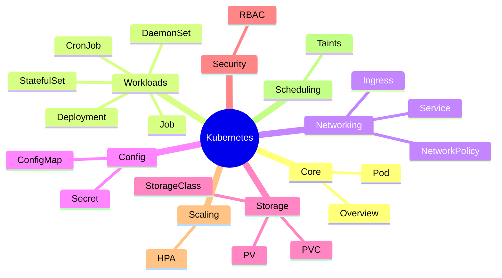
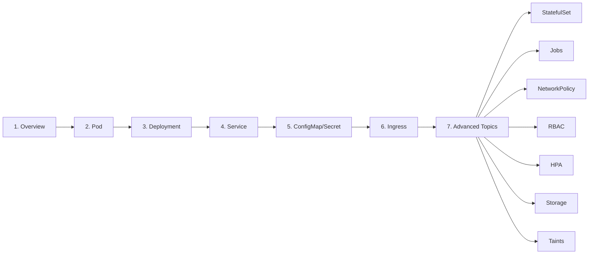

# Kubernetes Basics - Complete Guide

Welcome to my Kubernetes learning journey! This page contains all the K8s concepts every DevOps engineer should know, with diagrams and examples.

---

## 📚 All Posts

<ul class="index-list">
  <li>
    <a href="/blog/2025/02/11/kubernetes-overview.html">🚀 Kubernetes Overview: What is K8s?</a>
    
February 11, 2025 | Tags: kubernetes, basics, overview, architecture

    
Introduction to Kubernetes architecture, control plane components, and what K8s does for you.

  </li>

  <li>
    <a href="/blog/2025/02/11/kubernetes-pod.html">📦 Kubernetes Pod: The Smallest Unit</a>
    
February 11, 2025 | Tags: kubernetes, pod, workload, basics

    
Understanding Pods: single and multi-container pods, lifecycle, and pod vs container.

  </li>

  <li>
    <a href="/blog/2025/02/11/kubernetes-deployment.html">🔄 Kubernetes Deployment: Managing Pods at Scale</a>
    
February 11, 2025 | Tags: kubernetes, deployment, workload, scaling

    
Deployments for rolling updates, scaling, and self-healing applications.

  </li>

  <li>
    <a href="/blog/2025/02/11/kubernetes-service.html">🔗 Kubernetes Service: Networking Basics</a>
    
February 11, 2025 | Tags: kubernetes, service, networking, basics

    
Service types (ClusterIP, NodePort, LoadBalancer), DNS, and endpoints.

  </li>

  <li>
    <a href="/blog/2025/02/11/kubernetes-configmap-secret.html">⚙️ ConfigMap and Secret: Configuration in Kubernetes</a>
    
February 11, 2025 | Tags: kubernetes, configmap, secret, configuration

    
Managing configuration and sensitive data separately from container images.

  </li>

  <li>
    <a href="/blog/2025/02/11/kubernetes-ingress.html">🌐 Kubernetes Ingress: HTTP/HTTPS Routing</a>
    
February 11, 2025 | Tags: kubernetes, ingress, networking, routing

    
Ingress controllers, routing rules, TLS termination, and annotations.

  </li>

  <li>
    <a href="/blog/2025/02/11/kubernetes-statefulset-daemonset.html">🗄️ StatefulSet and DaemonSet: Specialized Workloads</a>
    
February 11, 2025 | Tags: kubernetes, statefulset, daemonset, workload

    
StatefulSets for databases, DaemonSets for node agents.

  </li>

  <li>
    <a href="/blog/2025/02/11/kubernetes-job-cronjob.html">⏰ Job and CronJob: Scheduled Workloads</a>
    
February 11, 2025 | Tags: kubernetes, job, cronjob, batch

    
Batch processing jobs and scheduled recurring tasks.

  </li>

  <li>
    <a href="/blog/2025/02/11/kubernetes-network-policy.html">🛡️ Kubernetes Network Policy: Traffic Control</a>
    
February 11, 2025 | Tags: kubernetes, network-policy, security, networking

    
Controlling traffic flow between pods with network policies.

  </li>

  <li>
    <a href="/blog/2025/02/11/kubernetes-rbac.html">🔐 Kubernetes RBAC: Access Control</a>
    
February 11, 2025 | Tags: kubernetes, rbac, security, authorization

    
Role-Based Access Control: Roles, ClusterRoles, and bindings.

  </li>

  <li>
    <a href="/blog/2025/02/11/kubernetes-hpa.html">📈 Horizontal Pod Autoscaler (HPA)</a>
    
February 11, 2025 | Tags: kubernetes, hpa, autoscaling, scaling

    
Auto-scaling pods based on CPU, memory, and custom metrics.

  </li>

  <li>
    <a href="/blog/2025/02/11/kubernetes-storage.html">💾 Kubernetes Storage: PV, PVC, StorageClass</a>
    
February 11, 2025 | Tags: kubernetes, storage, pv, pvc, volume

    
Persistent volumes, claims, and storage classes for data persistence.

  </li>

  <li>
    <a href="/blog/2025/02/11/kubernetes-taints-tolerations.html">🎯 Taints and Tolerations: Pod Scheduling Control</a>
    
February 11, 2025 | Tags: kubernetes, taint, toleration, scheduling

    
Controlling which pods can schedule on which nodes.

  </li>
</ul>

---

## 📖 Learning Path

I recommend learning these concepts in order:

### Core Concepts (Start Here)
1. **Overview** - Architecture and components
2. **Pod** - The smallest deployable unit
3. **Deployment** - Managing replicas and updates

### Networking & Configuration
4. **Service** - Internal networking
5. **ConfigMap/Secret** - Configuration management
6. **Ingress** - External HTTP/HTTPS access

### Advanced Topics
7. **StatefulSet** - For databases
8. **Job/CronJob** - Batch processing
9. **NetworkPolicy** - Traffic control
10. **RBAC** - Access control
11. **HPA** - Auto-scaling
12. **Storage** - Persistent data
13. **Taints/Tolerations** - Scheduling control

---

## 🛠️ Quick Reference

| Concept | Purpose | Link |
|---------|---------|------|
| **Pod** | Smallest unit | [Read →](/blog/2025/02/11/kubernetes-pod.html) |
| **Deployment** | Stateless apps | [Read →](/blog/2025/02/11/kubernetes-deployment.html) |
| **Service** | Stable endpoint | [Read →](/blog/2025/02/11/kubernetes-service.html) |
| **ConfigMap** | Non-sensitive config | [Read →](/blog/2025/02/11/kubernetes-configmap-secret.html) |
| **Secret** | Sensitive data | [Read →](/blog/2025/02/11/kubernetes-configmap-secret.html) |
| **Ingress** | HTTP routing | [Read →](/blog/2025/02/11/kubernetes-ingress.html) |
| **StatefulSet** | Databases | [Read →](/blog/2025/02/11/kubernetes-statefulset-daemonset.html) |
| **DaemonSet** | Node agents | [Read →](/blog/2025/02/11/kubernetes-statefulset-daemonset.html) |
| **Job** | One-time tasks | [Read →](/blog/2025/02/11/kubernetes-job-cronjob.html) |
| **CronJob** | Scheduled tasks | [Read →](/blog/2025/02/11/kubernetes-job-cronjob.html) |
| **NetworkPolicy** | Traffic rules | [Read →](/blog/2025/02/11/kubernetes-network-policy.html) |
| **RBAC** | Authorization | [Read →](/blog/2025/02/11/kubernetes-rbac.html) |
| **HPA** | Auto-scaling | [Read →](/blog/2025/02/11/kubernetes-hpa.html) |
| **PV/PVC** | Storage | [Read →](/blog/2025/02/11/kubernetes-storage.html) |
| **Taint** | Scheduling | [Read →](/blog/2025/02/11/kubernetes-taints-tolerations.html) |

---

## 🔗 External Resources

- [Kubernetes Documentation](https://kubernetes.io/docs/)
- [Kubectl Cheat Sheet](https://kubernetes.io/docs/reference/kubectl/cheatsheet/)
- [Interactive Tutorials](https://kubernetes.io/docs/tutorials/)

---

## 💡 Tips for Learning

1. **Practice locally** - Use minikube, kind, or k3d
2. **Read the docs** - Official docs are comprehensive
3. **Join the community** - Kubernetes Slack, Discord
4. **Build something** - Deploy a real application
5. **Get certified** - CKA, CKAD are valuable

---

*Last updated: February 2025*
